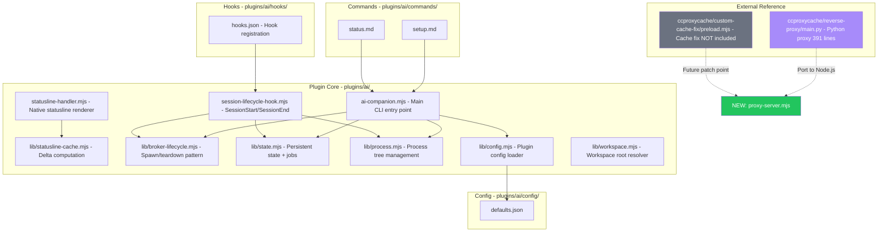
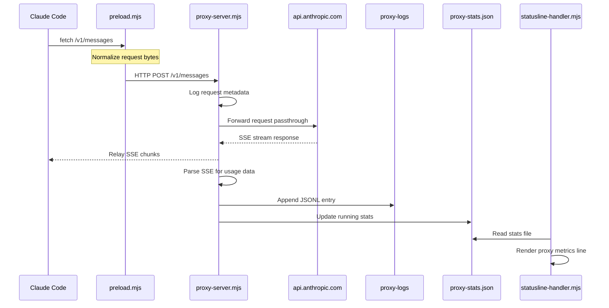
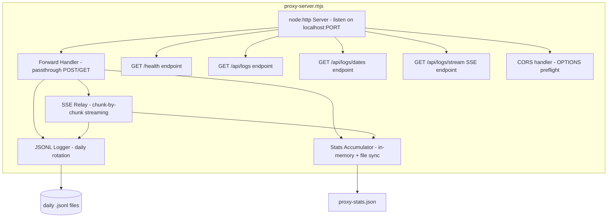
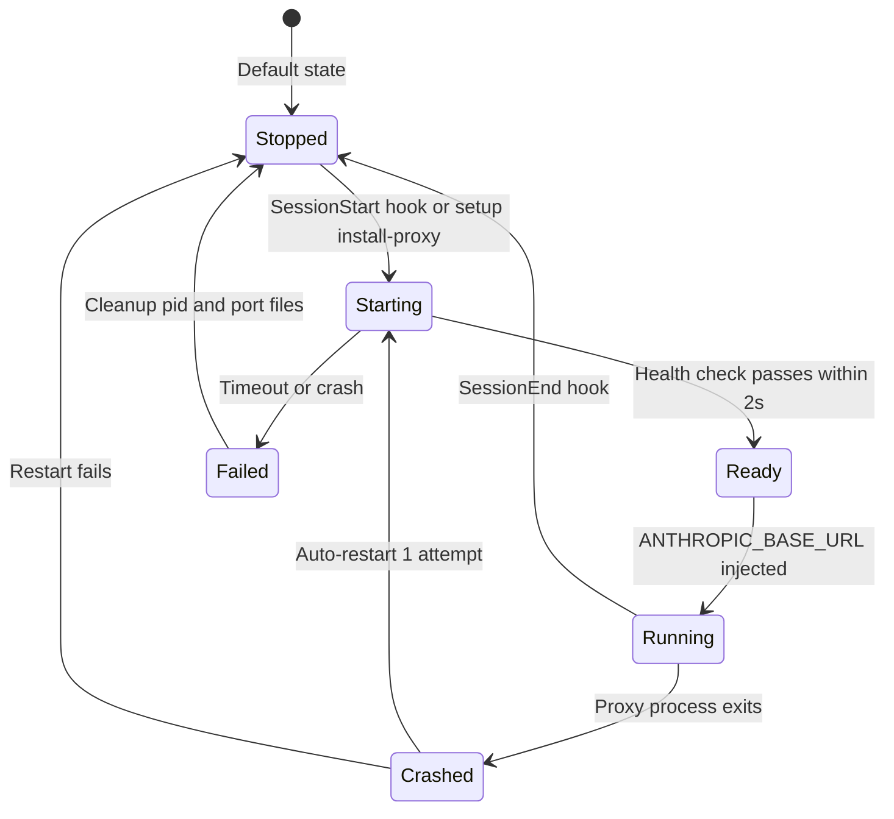
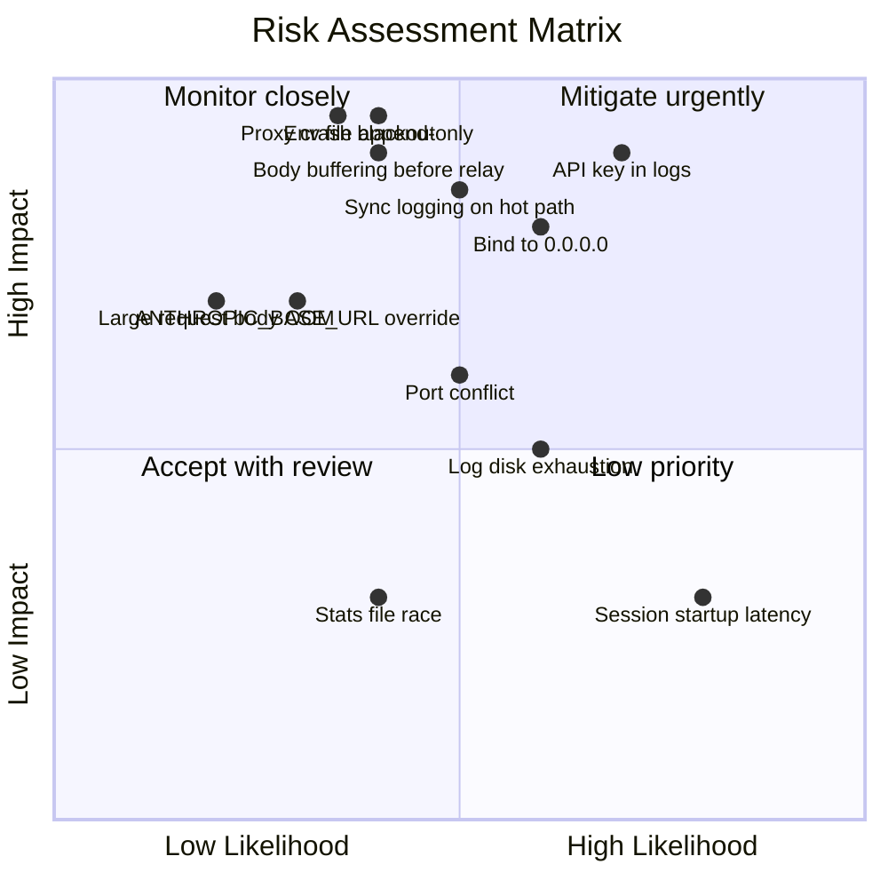
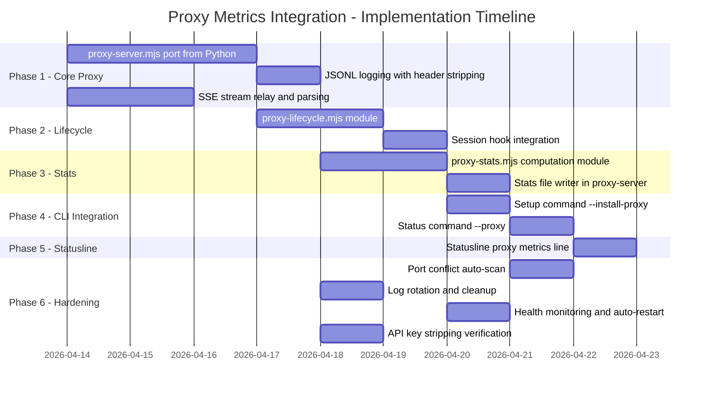

# FDR-02: Proxy Metrics Integration

**Status:** Proposed  
**Date:** 2026-04-13  
**Author:** AI Companion Team  
**Scope:** Backend (Server-side proxy + CLI integration)

---

## Summary

Embed a lightweight HTTP reverse proxy into the AI Companion plugin that sits between Claude Code and api.anthropic.com. The proxy operates as a pure passthrough (no request/response modification) with JSONL logging, enabling deep API telemetry: cache hit rate per call, quota burn rate (5h/7d windows), cache create vs read breakdown, context size per call, per-session stats (cost/cache%/tool breakdown), and full request/response inspection. The proxy is ported from the existing Python implementation at `ccproxycache/reverse-proxy/main.py` (391 lines) to Node.js.

**Critical constraint:** The proxy must have **zero observable impact** on API request/response performance. All logging, stats computation, and SSE fan-out happen asynchronously after the response has been fully relayed to the client. The hot path is: receive request → pipe to upstream → pipe response back. Everything else is off the critical path.

Key deliverables:
1. New proxy server at `plugins/ai/scripts/proxy-server.mjs` (Python-to-Node.js port)
2. Setup via `/ai:setup --install-proxy` to configure `ANTHROPIC_BASE_URL` and start proxy
3. Status via `/ai:status --proxy` for live KPI display
4. Proxy lifecycle management integrated into session hooks (SessionStart/SessionEnd)
5. SSE endpoint (`/api/logs/stream`) as data contract for future dashboard UI
6. Statusline enhancement showing proxy metrics when proxy is active
7. Cache fix from `ccproxycache/custom-cache-fix/preload.mjs` is explicitly NOT included — structured as a future plugin/patch point only

---

## Relevant Past Knowledge

No matching knowledge base entries found. The ccproxycache repository at `/home/compose-ai/ccproxycache/` serves as the source reference for the Python proxy implementation.

---

## Phase 1: MAP — Current Architecture

### Affected Module Dependency Graph



### Current Architecture Analysis

**Session Lifecycle Pattern (broker-lifecycle.mjs):**
The plugin already has a well-established pattern for spawning and managing long-lived child processes. `broker-lifecycle.mjs` provides: `spawnBrokerProcess()` (detached spawn with pid/log files), `waitForBrokerEndpoint()` (readiness polling with timeout), `teardownBrokerSession()` (graceful kill + cleanup), and `saveBrokerSession()`/`loadBrokerSession()`/`clearBrokerSession()` for state persistence. The proxy lifecycle MUST follow this exact pattern.

**SessionStart/SessionEnd Hooks (session-lifecycle-hook.mjs):**
- `handleSessionStart()` calls `appendEnvVar()` to inject environment variables via `CLAUDE_ENV_FILE`. This is the mechanism to inject `ANTHROPIC_BASE_URL=http://localhost:{port}` after the proxy starts.
- `handleSessionEnd()` tears down the broker, UI dashboard, and session jobs. The proxy cleanup must be added here.

**Setup Command (ai-companion.mjs, `handleSetup()`):**
- Already supports `--install-mermaid`, `--install-statusline`, `--install-rules` as boolean/value options.
- `--install-proxy` follows the same pattern: add to `booleanOptions`, implement handler block.

**Status Command (ai-companion.mjs + job-control.mjs):**
- `buildStatusSnapshot()` returns workspace config, session runtime, running/finished jobs. Proxy status would be an additional section.

**Statusline (statusline-handler.mjs):**
- Reads Claude Code's stdin JSON contract (context_window, cost, model). Proxy metrics are NOT in this contract. The statusline enhancement must use a sidecar mechanism: read from a proxy state file or make an HTTP call to the proxy's `/health` or `/api/stats` endpoint within the 200ms budget.

**Key Observations:**
- The Python proxy at `main.py` logs `request_headers: dict(self.headers)` which includes `x-api-key` and `authorization` headers. The Node.js port must strip authentication headers from JSONL logs.
- The Python proxy uses `http.server.ThreadingHTTPServer` with the `requests` library for upstream calls with `stream=True`. The Node.js port uses `node:http` for both server and upstream calls, with chunk-by-chunk streaming for SSE responses.
- **Performance architecture:** The proxy must add negligible latency (<5ms overhead per request). The critical path is a zero-copy pipe: `req.pipe(upstreamReq)` and `upstreamRes.pipe(clientRes)`. Node.js streams handle this natively — data flows through the kernel without userspace buffering. All logging, stats accumulation, and SSE fan-out happen by tapping the stream (passive `data` listeners on the already-piped response), NOT by buffering the full response before relaying. The only synchronous work on the hot path is header copying (~0.1ms).
- No existing log directory convention at `.claude/proxy-logs/` — this is new.
- The `preload.mjs` cache fix operates at the fetch interceptor level (modifying request body before it leaves the process). The proxy operates at the network level (logging wire traffic). They are orthogonal and can coexist: requests flow through `fetch interceptor (preload.mjs) -> proxy (localhost) -> upstream (api.anthropic.com)`.

**Test Coverage:** No test files exist in the plugin. All verification is manual.

---

## Phase 2: DESIGN — Proposed Implementation

### Data Flow Diagram



### Proxy Server Architecture



### What Changes -- File-by-File

| File | Change Type | Description |
|------|-------------|-------------|
| `plugins/ai/scripts/ai-companion.mjs` | MODIFY | Add `--install-proxy` to `handleSetup()` booleanOptions; add `--proxy` flag to status command; add proxy start/stop helpers |
| `plugins/ai/scripts/session-lifecycle-hook.mjs` | MODIFY | Add proxy auto-start in `handleSessionStart()` via `appendEnvVar("ANTHROPIC_BASE_URL", ...)`; add proxy cleanup in `handleSessionEnd()` |
| `plugins/ai/scripts/statusline-handler.mjs` | MODIFY | Add optional proxy metrics line (cache hit%, cost, quota) read from stats file within 200ms budget |
| `plugins/ai/commands/setup.md` | MODIFY | Add `--install-proxy` to argument-hint and description |
| `plugins/ai/commands/status.md` | MODIFY | Add `--proxy` to argument-hint |
| `plugins/ai/hooks/hooks.json` | NO CHANGE | Session hooks already call `session-lifecycle-hook.mjs`; proxy lifecycle is handled inside that script |
| `plugins/ai/scripts/lib/config.mjs` | NO CHANGE | Proxy config (port, upstream URL) comes from env vars, not plugin config |
| `plugins/ai/config/defaults.json` | NO CHANGE | No new provider or model config needed |

### What's New -- New Files

| File | Purpose |
|------|---------|
| `plugins/ai/scripts/proxy-server.mjs` | Main proxy server script. Node.js port of `ccproxycache/reverse-proxy/main.py`. HTTP server on configurable port, passthrough forwarding to upstream Anthropic API, JSONL logging with daily rotation, SSE endpoint for live log streaming, health check, stats accumulation. |
| `plugins/ai/scripts/lib/proxy-lifecycle.mjs` | Proxy lifecycle management following broker-lifecycle.mjs pattern: `startProxy()`, `stopProxy()`, `isProxyRunning()`, `loadProxySession()`, `saveProxySession()`, `clearProxySession()`. Manages pid file, port file, readiness polling. |
| `plugins/ai/scripts/lib/proxy-stats.mjs` | Stats computation module. Reads JSONL logs and computes: cache hit rate per call, quota burn rate (5h/7d windows), cache create vs read breakdown, context size per call, per-session aggregates (cost, cache%, tool breakdown). Writes summary to `resolveStateDir(cwd)/proxy-stats.json`. |

### Performance Architecture — Zero-Overhead Hot Path

The proxy MUST NOT add observable latency to API requests. The design achieves this through:

**1. Stream piping (not buffering):**
```
Client → req.pipe(upstreamReq) → Anthropic API
Anthropic API → upstreamRes.pipe(clientRes) → Client
```
Node.js `stream.pipe()` uses kernel-level data transfer. Response bytes flow from upstream socket to client socket without userspace copies. The proxy never waits for the full response before starting to relay — each SSE chunk is forwarded the instant it arrives.

**2. Passive tap for logging:**
The response stream is tapped with a non-blocking `data` listener that accumulates chunks into a buffer *in parallel* with the pipe to the client. The client receives data at wire speed; the logger sees the same data as a side-effect. JSONL write happens via `fs.appendFile()` (async) *after* the response stream ends — never blocking the relay.

**3. Async-only off-path work:**
- JSONL logging: `fs.appendFile()` after response completes — async, non-blocking
- Stats accumulation: in-memory counter updates (microseconds) — file sync on a 5-second `setInterval`, never on the hot path
- SSE fan-out to dashboard clients: `process.nextTick()` — deferred to after current I/O completes

**4. Latency budget:**
| Component | Budget | Mechanism |
|-----------|--------|-----------|
| Header copy + upstream connection | <5ms | localhost → remote; dominated by TLS handshake to upstream (unavoidable, same as direct) |
| Request body relay | 0ms added | `req.pipe(upstreamReq)` — kernel pipe |
| Response relay per chunk | 0ms added | `upstreamRes.pipe(clientRes)` — kernel pipe |
| JSONL write | 0ms on hot path | Async after stream end |
| Stats update | 0ms on hot path | In-memory counters, periodic file sync |

**Net effect:** The only added latency vs direct API calls is the localhost TCP round-trip (~0.1ms) plus header copy (~0.1ms). This is unmeasurable against typical API response times (2-30 seconds).

### What Breaks -- Behavioral Changes

1. **ANTHROPIC_BASE_URL override:** When proxy is active, all Claude Code API calls route through `http://localhost:{port}`. If the proxy crashes mid-session, Claude Code gets `ECONNREFUSED` on every API call until the session ends or the proxy restarts. This is the single most impactful behavioral change.
2. **SessionStart latency increase:** Starting the proxy adds ~500-1000ms to session startup (spawn + readiness poll). This is within the 5s hook timeout but noticeable.
3. **Disk usage:** JSONL logs accumulate in `.claude/proxy-logs/`. A heavy session can generate 10-50MB/day of log data. No automatic cleanup policy by default.
4. **Statusline render time:** If proxy stats file read is slow (cold filesystem), the statusline could exceed its 200ms budget. Degradation is graceful (falls back to non-proxy display).
5. **API request/response performance:** No observable impact. See Performance Architecture above.

### Port Mapping: Python to Node.js

| Python (main.py) | Node.js (proxy-server.mjs) | Notes |
|---|---|---|
| `http.server.ThreadingHTTPServer` | `node:http.createServer()` | Node.js is single-threaded + async; no threading needed |
| `requests.post(..., stream=True)` | `req.pipe(upstreamReq)` + `upstreamRes.pipe(clientRes)` | **Key perf change:** kernel-level stream piping replaces Python's userspace buffering. Zero-copy relay — data never sits in JS heap on the hot path |
| `resp.iter_lines()` | Passive `response.on('data', tap)` listener on piped stream | Tap runs in parallel with pipe; does not block relay to client |
| `threading.Lock` for log writes | Single-threaded; use `fs.appendFile()` (async) after stream end | No lock needed; write is fully off the hot path |
| `json.dumps(entry, default=str)` | `JSON.stringify(entry, replacer)` | Need a replacer for non-serializable values |
| `self.rfile.read(content_length)` | `req.pipe(upstreamReq)` for body forwarding | **Key perf change:** body streams directly to upstream, not buffered in memory first |
| `HOP_BY_HOP` header stripping | Same set of headers to strip | Direct port |
| `_parse_sse_chunks()` | `parseSSEChunks()` in tap listener | Parse `data: {...}` lines for usage extraction; off hot path |

### Header Stripping for Log Security

The Python proxy logs all request headers including `x-api-key`. The Node.js port MUST strip these from log entries:

```
Stripped from log entries (still forwarded to upstream):
  - x-api-key
  - authorization
  - cookie
  - proxy-authorization
```

### Stats File Contract (resolveStateDir(cwd)/proxy-stats.json)

The stats file is workspace-scoped using `resolveStateDir(cwd)` (from `lib/state.mjs`), NOT global. This prevents collisions when multiple workspaces run proxies simultaneously on different ports.

```json
{
  "proxyPort": 3001,
  "upSince": "2026-04-13T10:00:00.000Z",
  "sessionId": "abc123",
  "totalRequests": 42,
  "totalErrors": 1,
  "cacheHitRate": 0.73,
  "cacheSummary": {
    "cacheCreationTokens": 120000,
    "cacheReadTokens": 890000,
    "uncachedInputTokens": 45000
  },
  "quotaBurn": {
    "last5h": { "requests": 38, "inputTokens": 1055000, "outputTokens": 42000, "estimatedCostUsd": 1.23 },
    "last7d": { "requests": 312, "inputTokens": 8900000, "outputTokens": 380000, "estimatedCostUsd": 12.50 }
  },
  "lastRequest": {
    "timestamp": "2026-04-13T14:32:01.123Z",
    "model": "claude-sonnet-4-6",
    "elapsedMs": 2340,
    "inputTokens": 28000,
    "outputTokens": 1200,
    "cacheReadTokens": 24000,
    "cacheCreationTokens": 0
  },
  "updatedAt": "2026-04-13T14:32:01.123Z"
}
```

### Proxy Lifecycle Integration



### Setup Flow: /ai:setup --install-proxy

1. Check if proxy is already installed (proxy session file exists and process is alive)
2. Find available port (default 7001, scan 3001-3010 if occupied)
3. Spawn `proxy-server.mjs` as detached child process (following broker-lifecycle.mjs pattern)
4. Write pid file and port file to proxy session directory
5. Poll `/health` endpoint until ready (max 2s timeout)
6. Save proxy session state via `saveProxySession(cwd, session)`
7. If run during active session: inject `ANTHROPIC_BASE_URL` via `appendEnvVar()`
8. Report result: port, pid, log directory

### Status Flow: /ai:status --proxy

1. Load proxy session state
2. If no session: report "Proxy not active"
3. If session exists: check process alive + HTTP health
4. Read `resolveStateDir(cwd)/proxy-stats.json` for metrics
5. Render KPI summary: cache hit%, quota burn rate, cost, request count, uptime

---

## Phase 3: STRESS-TEST -- Edge Cases and Failure Modes

### Input Boundaries

| # | Scenario | What Goes Wrong | Handling | Severity |
|---|----------|-----------------|----------|----------|
| 1 | Request body > 10MB (large context) | Memory spike during body buffering; slow log writes | Stream body to file if > 5MB; truncate `request_body` in log entry to first 100KB with `[truncated]` marker | **High** |
| 2 | Non-JSON request body | `JSON.parse()` throws on binary or form data | Catch parse errors; store as `{ "_raw": "<hex preview>" }` (matches Python behavior) | **Low** |
| 3 | Empty POST body | `Content-Length: 0` or missing; body parsing returns empty | Default to `{}` for log entry; forward to upstream unchanged | **Low** |
| 4 | Malformed SSE chunks (partial JSON in data: line) | Usage parsing fails; incomplete text assembly | Wrap each chunk parse in try/catch; accumulate text parts independently of usage parsing | **Medium** |
| 5 | Very long streaming response (>5 min) | Upstream timeout; client disconnect; memory from chunk accumulation | Use 600s timeout (matches Python); flush chunks to log incrementally; detect client disconnect early | **Medium** |

### Concurrency

| # | Scenario | What Goes Wrong | Handling | Severity |
|---|----------|-----------------|----------|----------|
| 6 | Multiple concurrent API calls from Claude Code | Node.js handles concurrent requests on single thread; no data race | Async request handlers are naturally isolated; JSONL append is sequential within event loop | **Low** |
| 7 | Stats file read while being written | Statusline reads partial/corrupt JSON | Write stats atomically (write to `.tmp`, rename); statusline wraps read in try/catch with fallback | **Medium** |
| 8 | Two Claude Code sessions start on same port | Second proxy spawn fails with `EADDRINUSE` | Port conflict detection in startup; auto-scan for next available port (3001-3010) | **High** |

### State Transitions

| # | Scenario | What Goes Wrong | Handling | Severity |
|---|----------|-----------------|----------|----------|
| 9 | Proxy crashes mid-request | Claude Code gets `ECONNREFUSED`; all subsequent API calls fail until session restart | SessionStart hook should check proxy health on existing session; implement 1-attempt auto-restart via health monitor | **Critical** |
| 10 | Proxy started but SessionEnd not called (crash/kill -9) | Orphan proxy process; stale pid/port files | Proxy checks for stale session on next start; kill orphan if pid file points to dead process | **High** |
| 11 | `ANTHROPIC_BASE_URL` already set by user | Plugin overwrites user's custom base URL | Check if `ANTHROPIC_BASE_URL` is already set and not pointing to localhost; skip injection if user has custom upstream | **High** |
| 12 | Port file exists but process is dead | `isProxyRunning()` returns false despite session state | Check both pid file AND HTTP health; clear stale state before restarting | **Medium** |

### Security

| # | Scenario | What Goes Wrong | Handling | Severity |
|---|----------|-----------------|----------|----------|
| 13 | API key logged in JSONL request headers | Secret exposure in log files; credential leak if logs shared | Strip `x-api-key`, `authorization`, `cookie`, `proxy-authorization` from `request_headers` before logging; headers still forwarded to upstream | **Critical** |
| 14 | JSONL logs readable by other users | Multi-user system exposes API traffic | Set log file permissions to 0600 (owner read/write only); log directory permissions 0700 | **Medium** |
| 15 | Proxy binds to 0.0.0.0 | Network-accessible proxy exposes API key in transit | Bind to `127.0.0.1` only (not `0.0.0.0` as in Python original) | **High** |
| 16 | Response body contains sensitive data in logs | Full API responses logged including any PII in assistant output | Accept this for debugging utility; document in setup output; provide `--proxy-log-level minimal` future option to log only metadata | **Medium** |

### External Dependencies

| # | Scenario | What Goes Wrong | Handling | Severity |
|---|----------|-----------------|----------|----------|
| 17 | Upstream api.anthropic.com unreachable | Proxy returns 502; Claude Code retries | Proxy returns `502 { error: "upstream error: ..." }` (matches Python behavior); log the error | **Medium** |
| 18 | Upstream returns non-SSE response (e.g., 429 rate limit) | Response is not streaming; relay handler must detect | Check `content-type` header; use full-body relay for non-SSE responses (matches Python `_relay_full` vs `_relay_stream` logic) | **Medium** |
| 19 | DNS resolution failure | `ENOTFOUND` on upstream hostname | Catch and return 502 with clear error message | **Low** |

### Resource Exhaustion

| # | Scenario | What Goes Wrong | Handling | Severity |
|---|----------|-----------------|----------|----------|
| 20 | JSONL logs grow unbounded | Disk fills up over days/weeks of use | Daily rotation (one file per day); add configurable `PROXY_LOG_MAX_DAYS` env var (default 30); clean old files on startup | **High** |
| 21 | Stats file accumulator grows large | `resolveStateDir(cwd)/proxy-stats.json` grows with per-request history | Keep only aggregate stats + last request; no per-request history in stats file (that's what JSONL logs are for) | **Low** |
| 22 | Hundreds of SSE stream connections to /api/logs/stream | Memory and file descriptor exhaustion | Limit to 5 concurrent SSE clients; return 503 for excess | **Low** |

### Performance

| # | Scenario | What Goes Wrong | Handling | Severity |
|---|----------|-----------------|----------|----------|
| 23 | Sync logging blocks response relay | `fs.appendFileSync()` or `await fs.writeFile()` on hot path adds 1-5ms per request; compounds during streaming | Use `fs.appendFile()` (async, no await) called only after stream ends; never block the pipe | **Critical** |
| 24 | Full body buffering before relay | Python-style `body = await collectAll(req)` adds TTFB equal to full request size | Use `req.pipe(upstreamReq)` — stream body directly; only tap for logging metadata | **Critical** |
| 25 | Usage parsing blocks SSE chunk relay | Parsing JSON from SSE data lines in the relay path delays chunk forwarding | `upstreamRes.pipe(clientRes)` handles relay; parsing happens in a separate `data` listener that cannot block the pipe | **High** |
| 26 | Stats file write I/O pressure | Writing `proxy-stats.json` on every request causes disk I/O contention | In-memory accumulators updated per request (microseconds); file sync on 5-second `setInterval` only | **Medium** |
| 27 | GC pauses during high-throughput streaming | Large accumulated chunk buffers cause V8 garbage collection pauses | Chunk buffer for logging is a string append (cheap); cleared after JSONL write; keep heap allocation minimal | **Low** |

### Compatibility

| # | Scenario | What Goes Wrong | Handling | Severity |
|---|----------|-----------------|----------|----------|
| 28 | preload.mjs cache fix active simultaneously | Requests modified by fetch interceptor before reaching proxy; proxy logs the modified (normalized) request, not the original | This is correct behavior -- proxy sees wire-level traffic. Document in setup output that preload.mjs and proxy are orthogonal | **Info** |
| 29 | Claude Code updates change API contract | New headers, new SSE event types, new endpoints | Proxy is passthrough -- new traffic is forwarded unchanged. Usage parsing may miss new fields but fails gracefully | **Low** |
| 30 | Windows/WSL path differences | Log directory path resolution, pid file paths | Use `path.join()` and `os.tmpdir()` consistently; avoid hardcoded `/` separators | **Medium** |

---

## Phase 4: ASSESS -- Risk Matrix



### Risk Details

| Risk | Likelihood | Impact | Score | Mitigation | Residual Risk | Owner |
|------|-----------|--------|-------|------------|---------------|-------|
| **Proxy crash = API blackout** | Possible -- unhandled exception, OOM, segfault | Catastrophic -- Claude Code session becomes non-functional | **Critical** | Auto-restart on crash (1 attempt); health monitor in session hooks; clear `ANTHROPIC_BASE_URL` if restart fails (requires session env mutation) | If restart also fails, session is broken until manual restart | Backend |
| **API key logged in JSONL** | Likely -- Python original logs all headers; easy to port the bug | Catastrophic -- credential exposure | **Critical** | Explicit header stripping list (`x-api-key`, `authorization`, `cookie`, `proxy-authorization`); unit test that verifies stripping | Developer may add new auth header that isn't in strip list | Backend |
| **Bind to 0.0.0.0** | Likely if ported verbatim from Python | Major -- proxy accessible on network, API key in transit | **High** | Bind to `127.0.0.1` explicitly; document this differs from Python original | None if enforced | Backend |
| **Port conflict with other services** | Possible -- port 3001 is common | Moderate -- proxy fails to start; session starts without metrics | **High** | Auto-scan ports 3001-3010; report chosen port in setup output and status | All 10 ports could be occupied (extremely unlikely) | Backend |
| **ANTHROPIC_BASE_URL already set** | Unlikely -- most users use default | Major -- overwriting user's custom API endpoint breaks their setup | **High** | Check existing value; skip if already set to non-localhost URL; warn user | User may set it to localhost for different proxy | Backend |
| **Log disk exhaustion** | Possible -- heavy users over weeks | Moderate -- disk fills; other processes affected | **Medium** | `PROXY_LOG_MAX_DAYS=30` default; cleanup on startup; warn in `/ai:status --proxy` if logs > 500MB | User may not notice until disk is full | Backend |
| **Session startup latency** | Likely -- proxy spawn + readiness poll | Minor -- 500-1000ms added to session start | **Low** | Async spawn with readiness polling (max 2s); acceptable within 5s hook timeout | Slow machines may approach timeout | Backend |
| **Stats file read race** | Possible -- concurrent write/read | Minor -- statusline shows stale or fallback data | **Low** | Atomic write (tmp + rename); try/catch in reader | Brief window where file doesn't exist during rename | Backend |
| **Large request body OOM** | Unlikely -- Claude Code context is typically < 5MB | Major -- proxy process crashes | **Medium** | Stream body to temp file if > 5MB; truncate in log; set max body size limit | Very large tool results could still spike memory | Backend |
| **CLAUDE_ENV_FILE is append-only** | Likely -- any proxy crash after env injection | Catastrophic -- ANTHROPIC_BASE_URL still points to dead proxy; Claude Code gets ECONNREFUSED on every API call; session is bricked | **Critical** | Auto-restart proxy on crash (1 attempt); if restart fails, log prominent warning. User must manually restart the Claude Code session to recover. Future: request Claude Code API for env variable mutation or removal | If auto-restart fails, session is unrecoverable without manual intervention. This is the most dangerous residual risk of the entire feature | Backend |
| **Sync logging blocks hot path** | Possible -- easy implementation mistake during port | Major -- adds 1-5ms per request; SSE chunks delayed; user-visible latency in streaming responses | **Critical** | Enforce stream piping architecture: `req.pipe(upstreamReq)`, `upstreamRes.pipe(clientRes)`. All logging via async `fs.appendFile()` after stream end. Code review gate: no `Sync` methods, no `await` on I/O in request handler | If developer uses `appendFileSync` or buffers body before relay, performance degrades silently — add benchmark test in FAC-15 | Backend |
| **Body buffering before relay** | Possible -- Python original buffers full body | Major -- TTFB equals full request transfer time instead of near-zero; large contexts (>1MB) create noticeable delay | **Critical** | Use `req.pipe()` for request forwarding — body streams directly to upstream without JS heap allocation. Only tap stream for model/metadata extraction (first few hundred bytes) | If pipe breaks due to upstream error, fallback to buffered relay for error response only | Backend |

---

## Phase 5: PLAN -- Implementation and Rollout

### Implementation Timeline



### Implementation Steps

#### Step 1: Core Proxy Server (3 days)
**Files:** NEW `plugins/ai/scripts/proxy-server.mjs`
**Changes:**
- Port Python `main.py` to Node.js using `node:http.createServer()`
- Implement `ProxyHandler` class with `handleGet()`, `handlePost()`, `handleOptions()`
- Forward requests to `ANTHROPIC_FORWARD_URL` (default: `https://api.anthropic.com`) using `node:http.request()`
- **Zero-overhead relay:** Use `req.pipe(upstreamReq)` for request body and `upstreamRes.pipe(clientRes)` for response body — kernel-level stream piping, no userspace buffering on the hot path
- Tap response stream with passive `data` listener for logging/stats (runs in parallel with pipe, does not block relay)
- Bind to `127.0.0.1` (NOT `0.0.0.0`)
- Environment variables: `PROXY_PORT` (default 7001), `ANTHROPIC_FORWARD_URL`, `PROXY_LOG_DIR`
- Health endpoint: `GET /health` returns `{ status: "healthy", uptime: N, port: N }`
- CORS handling for dashboard API endpoints
**Dependencies:** None
**Effort:** 3 days (bulk of the work -- SSE streaming relay is the hardest part)

#### Step 2: JSONL Logging (1 day)
**Files:** `plugins/ai/scripts/proxy-server.mjs` (logging module within)
**Changes:**
- Daily JSONL file rotation: `.claude/proxy-logs/YYYY-MM-DD.jsonl`
- Log entry structure: timestamp, method, path, model, is_streaming, request_headers (STRIPPED), request_body, elapsed_s, response_status, response_headers, response_usage, response_text, response_chunk_count
- Header stripping: remove `x-api-key`, `authorization`, `cookie`, `proxy-authorization` from logged request headers
- File permissions: `0o600` for log files, `0o700` for log directory
- `fs.appendFileSync()` for writes (single-threaded, no lock needed)
- Large body handling: truncate `request_body` to 100KB in log entry; store full body reference if > 5MB
**Dependencies:** Step 1
**Effort:** 1 day

#### Step 3: SSE Stream Relay and Parsing (2 days, parallel with Step 1)
**Files:** `plugins/ai/scripts/proxy-server.mjs`
**Changes:**
- Detect streaming responses by checking `is_streaming` flag in request body AND `content-type: text/event-stream` in response
- For streaming: `upstreamRes.pipe(clientRes)` relays chunks at wire speed; a passive `data` listener on the same stream taps chunks for usage extraction — client sees zero added latency
- For non-streaming: buffer full response body, relay with correct `Content-Length`
- Parse SSE `data: {...}` lines to extract usage info (input_tokens, output_tokens, cache_creation_input_tokens, cache_read_input_tokens) from `message_start`, `message_delta`, `content_block_delta` events — parsing happens in the tap listener, not on the relay path
- Handle partial SSE lines spanning chunk boundaries (line buffer)
- Handle client disconnect mid-stream (catch `EPIPE` / `ERR_STREAM_WRITE_AFTER_END`)
**Dependencies:** Step 1
**Effort:** 2 days

#### Step 4: Proxy Lifecycle Module (2 days)
**Files:** NEW `plugins/ai/scripts/lib/proxy-lifecycle.mjs`
**Changes:**
- Follow `broker-lifecycle.mjs` pattern exactly:
  - `startProxy(cwd, options)` -- spawn detached, write pid/port files, poll `/health`
  - `stopProxy(cwd)` -- read pid file, kill process tree, cleanup files
  - `isProxyRunning(cwd)` -- check pid + HTTP health
  - `saveProxySession(cwd, session)` / `loadProxySession(cwd)` / `clearProxySession(cwd)`
- Session state stored at `resolveStateDir(cwd)/proxy.json`
- Port auto-scan: try 3001-3010, use first available
- Readiness polling: `GET /health` every 50ms, max 2s timeout
**Dependencies:** Step 1
**Effort:** 2 days

#### Step 5: Session Hook Integration (1 day)
**Files:** MODIFY `plugins/ai/scripts/session-lifecycle-hook.mjs`
**Changes:**
- In `handleSessionStart()`: if proxy session exists and process is alive, inject `ANTHROPIC_BASE_URL=http://localhost:{port}` via `appendEnvVar()`
- In `handleSessionEnd()`: call `stopProxy(cwd)` to cleanup proxy process
- Guard: check if `ANTHROPIC_BASE_URL` is already set to a non-localhost URL; skip injection if so
- Import `loadProxySession`, `stopProxy`, `isProxyRunning` from `proxy-lifecycle.mjs`
**Dependencies:** Step 4
**Effort:** 1 day

#### Step 6: Stats Computation Module (2 days)
**Files:** NEW `plugins/ai/scripts/lib/proxy-stats.mjs`
**Changes:**
- `computeStats(logDir, options)` -- read JSONL files, compute aggregates
- Metrics: cache hit rate (cache_read / total_input), quota burn (5h/7d windows), cache create vs read breakdown, context size per call, per-session cost estimate
- Cost estimation using hardcoded Anthropic pricing constants (input/output/cache token rates per model). These constants need manual updates when Anthropic changes pricing -- a future enhancement could load rates from a config file
- Write aggregates to `resolveStateDir(cwd)/proxy-stats.json` atomically (write `.tmp`, rename)
- Called by proxy-server.mjs after each logged request (lightweight -- only updates in-memory accumulators, periodic file sync)
**Dependencies:** Step 2
**Effort:** 2 days

#### Step 7: Stats File Writer in Proxy Server (1 day)
**Files:** MODIFY `plugins/ai/scripts/proxy-server.mjs`
**Changes:**
- After each request is logged, update in-memory stats accumulator
- Sync to `resolveStateDir(cwd)/proxy-stats.json` every 5 seconds (not every request -- avoid I/O pressure)
- Include `proxyPort`, `upSince`, `totalRequests`, `totalErrors`, `cacheHitRate`, `cacheSummary`, `quotaBurn`, `lastRequest`, `updatedAt`
**Dependencies:** Step 6
**Effort:** 1 day

#### Step 8: Setup Command --install-proxy (1 day)
**Files:** MODIFY `plugins/ai/scripts/ai-companion.mjs`, MODIFY `plugins/ai/commands/setup.md`
**Changes:**
- Add `"install-proxy"` to `booleanOptions` in `handleSetup()`
- When `--install-proxy`: call `startProxy(cwd)` from proxy-lifecycle.mjs
- Report: proxy port, pid, log directory, instructions
- If in active session: inject `ANTHROPIC_BASE_URL` via `appendEnvVar()`
- Update `setup.md` argument-hint to include `[--install-proxy]`
**Dependencies:** Step 4, Step 5
**Effort:** 1 day

#### Step 9: Status Command --proxy (1 day)
**Files:** MODIFY `plugins/ai/scripts/ai-companion.mjs`, MODIFY `plugins/ai/commands/status.md`
**Changes:**
- Add `"proxy"` to `booleanOptions` in status command handler
- When `--proxy`: read proxy session + stats file; render KPI table
- KPIs: cache hit%, cache create/read breakdown, quota burn (5h/7d), cost estimate, request count, uptime, last request model/timing
- If proxy not active: report "Proxy not running. Install with /ai:setup --install-proxy"
**Dependencies:** Step 7
**Effort:** 1 day

#### Step 10: Statusline Proxy Metrics (1 day)
**Files:** MODIFY `plugins/ai/scripts/statusline-handler.mjs`
**Changes:**
- After rendering existing Line 1 and Line 2, check for `resolveStateDir(cwd)/proxy-stats.json`
- If exists and recent (< 30s old): render Line 3 with proxy metrics
- Format: `[Proxy] cache: 73% | burn: $1.23/5h | reqs: 42 | up: 2h 15m`
- Must stay within 200ms total budget -- use sync file read with try/catch
**Dependencies:** Step 7
**Effort:** 1 day

#### Step 11: Port Conflict Auto-scan (1 day)
**Files:** MODIFY `plugins/ai/scripts/lib/proxy-lifecycle.mjs`
**Changes:**
- In `startProxy()`: attempt to bind on port 3001; if `EADDRINUSE`, try 3002-3010
- Use `net.createServer().listen(port)` test to check availability before spawning
- Report chosen port in session state
**Dependencies:** Step 4
**Effort:** 1 day

#### Step 12: Log Rotation and Cleanup (1 day)
**Files:** MODIFY `plugins/ai/scripts/proxy-server.mjs`
**Changes:**
- On startup: scan `.claude/proxy-logs/` for files older than `PROXY_LOG_MAX_DAYS` (default 30)
- Delete old files; log cleanup count
- One file per UTC day (same as Python original)
**Dependencies:** Step 2
**Effort:** 1 day

#### Step 13: Health Monitoring and Auto-restart (1 day)
**Files:** MODIFY `plugins/ai/scripts/lib/proxy-lifecycle.mjs`
**Changes:**
- `ensureProxyHealthy(cwd)` -- check health, attempt restart if down
- Called from `handleSessionStart()` for existing proxy sessions
- Max 1 restart attempt; if restart fails, log warning and clear session
- On restart failure: ideally unset `ANTHROPIC_BASE_URL` but `CLAUDE_ENV_FILE` is append-only -- document this limitation
**Dependencies:** Step 4, Step 5
**Effort:** 1 day

#### Step 14: API Key Stripping Verification (1 day)
**Files:** Manual verification script or inline assertions
**Changes:**
- Add assertion in JSONL write path: verify no entry contains `x-api-key` or `authorization` in `request_headers`
- Add startup self-test: create a test request with auth header, verify it's stripped from log entry
- Document the stripped header list prominently in proxy-server.mjs header comment
**Dependencies:** Step 2
**Effort:** 1 day

### Rollout Plan

1. **Dev testing (Week 1):** Port proxy, run against live API traffic, verify passthrough correctness (responses byte-identical), verify JSONL completeness
2. **Integration testing (Week 2):** Test with session hooks, verify `ANTHROPIC_BASE_URL` injection, test crash/restart scenarios, verify preload.mjs coexistence
3. **Dogfood (Week 2-3):** Run proxy in daily development workflow; monitor log sizes, stats accuracy, session startup latency
4. **Release:** Bump plugin version; add to CHANGELOG; document in CLAUDE.md

### Future Extension Points

- **Cache fix integration:** `preload.mjs` from ccproxycache could be integrated as a proxy plugin/middleware. The proxy-server.mjs architecture should support a request transform hook (currently no-op) for this future use case.
- **Dashboard UI:** The SSE endpoint `/api/logs/stream` and REST API (`/api/logs`, `/api/logs/dates`) are designed for a future web dashboard. The data contract is defined by the JSONL log entry schema and stats file schema.
- **Proxy log level:** `PROXY_LOG_LEVEL=minimal|standard|verbose` to control what's logged (metadata only vs full request/response bodies).

---

## Feature Acceptance Criteria (FAC)

| ID | Criterion | Verification |
|----|-----------|-------------|
| FAC-01 | Proxy starts on configurable port and forwards all requests to api.anthropic.com unchanged | Send test request through proxy; compare response to direct API call |
| FAC-02 | Proxy logs all requests/responses to daily JSONL files in `.claude/proxy-logs/` | Verify JSONL file created with correct structure after API call |
| FAC-03 | API keys are stripped from JSONL log entries | Grep log files for `x-api-key`; verify absence |
| FAC-04 | `/ai:setup --install-proxy` starts proxy and reports port/pid | Run command; verify proxy process running and health endpoint responds |
| FAC-05 | `ANTHROPIC_BASE_URL` is injected into session environment when proxy is active | Verify env var set after SessionStart hook runs |
| FAC-06 | `/ai:status --proxy` displays live KPIs (cache hit%, quota burn, cost) | Run command; verify output contains metrics matching JSONL data |
| FAC-07 | Proxy is cleaned up on SessionEnd | End session; verify proxy process terminated and pid file removed |
| FAC-08 | SSE endpoint `/api/logs/stream` streams new log entries | Connect with curl; make API call; verify SSE events received |
| FAC-09 | Statusline shows proxy metrics when proxy is active | Verify third line appears in statusline output with cache/burn/reqs data |
| FAC-10 | Proxy binds to 127.0.0.1 only (not 0.0.0.0) | Attempt connection from another host; verify refused |
| FAC-11 | Port conflict is handled with auto-scan (3001-3010) | Start service on 3001; run --install-proxy; verify proxy uses different port |
| FAC-12 | Old JSONL log files are cleaned up (default 30 days) | Create old log file; start proxy; verify old file deleted |
| FAC-13 | Proxy does NOT modify request or response bodies | Byte-compare proxied vs direct API responses |
| FAC-14 | Cache fix (preload.mjs) is NOT included | Verify no fetch interceptor code in proxy-server.mjs |
| FAC-15 | Proxy adds <5ms overhead per request (zero observable latency) | Benchmark 50 requests with/without proxy; measure p50/p95 TTFB delta |
| FAC-16 | Response relay uses stream piping, not full-body buffering | Code review: verify `upstreamRes.pipe(clientRes)` on hot path; no `await collectBody()` before relay |
| FAC-17 | JSONL logging and stats updates are async and off the hot path | Code review: verify `fs.appendFile()` (not sync) called after stream end; no `await` on log write before client response completes |
| FAC-18 | SSE chunks are relayed to client at wire speed (not batched) | Streaming test: verify first SSE chunk arrives within 5ms of upstream sending it |
