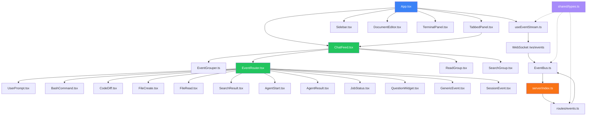
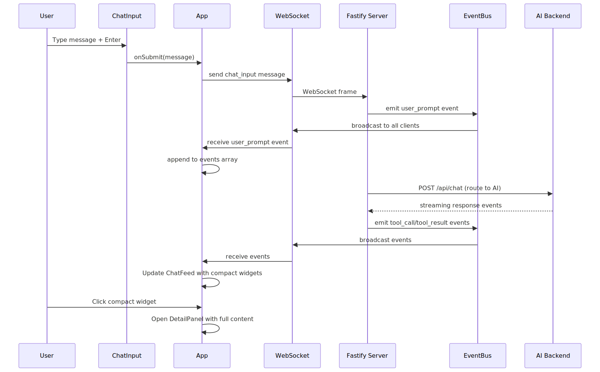
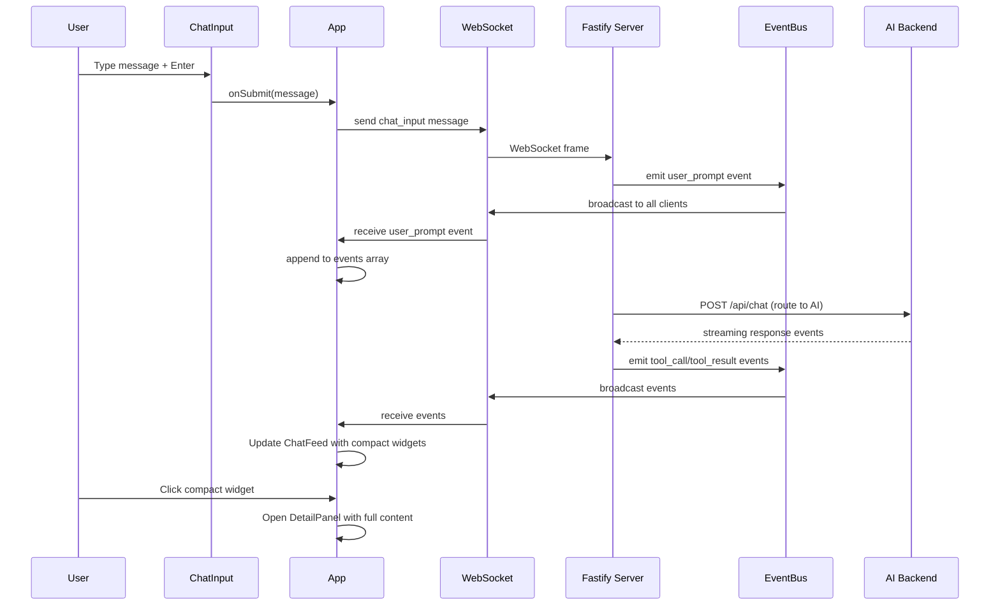
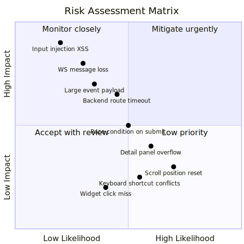
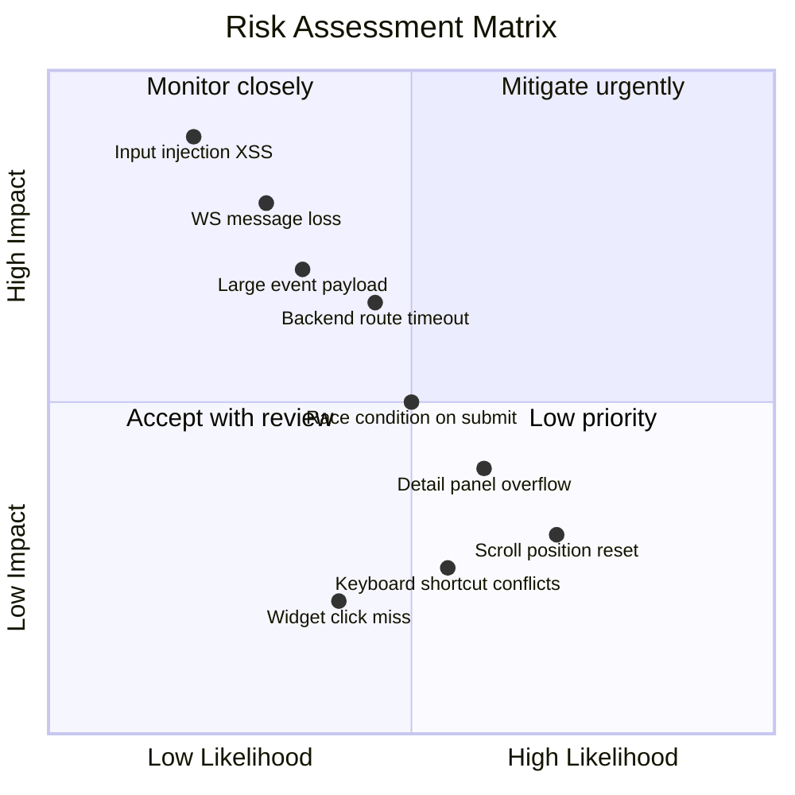
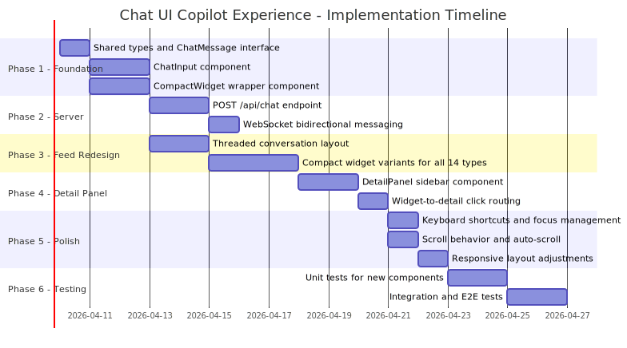
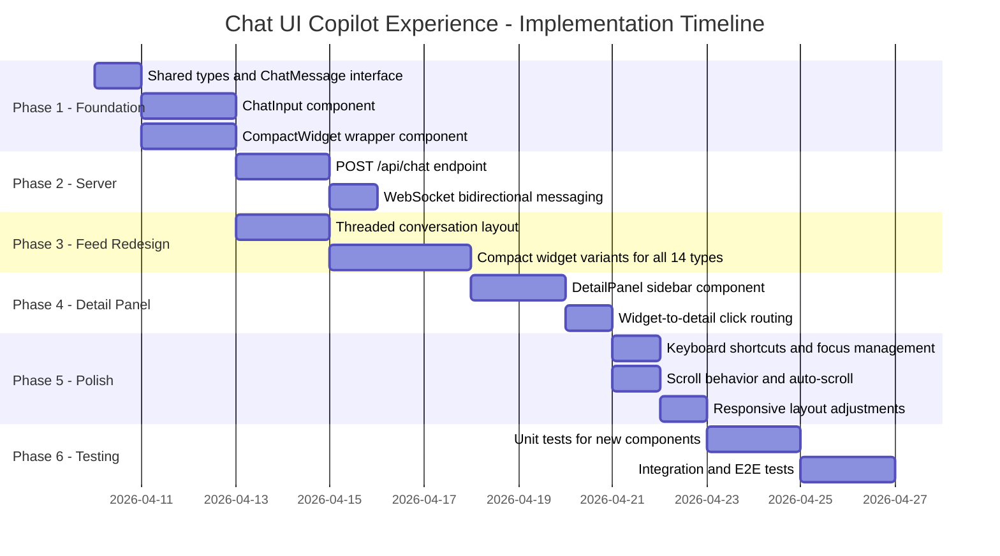

# FDR-01: Chat UI Redesign — Copilot Chat VS Code Experience

**Status:** Proposed  
**Date:** 2026-04-09  
**Author:** AI Companion Team  
**Scope:** Fullstack (Frontend UI Redesign + Server API for Chat Input Routing)

---

## Summary

Transform the existing read-only event feed (`ChatFeed.tsx`) into an interactive, conversation-style chat UI inspired by VS Code Copilot Chat. The redesign introduces a `ChatInput` component for sending queries, compact input/output card widgets (max 4 lines, collapsible), a detail sidebar for full content inspection, and a threaded conversation layout grouping user prompts with their resulting tool events.

---

## Relevant Past Knowledge

No matching knowledge base entries found.

---

## Phase 1: MAP — Current Architecture

### Affected Module Dependency Graph

Mermaid source

### Current Architecture Analysis

**Data Flow (read-only):**
1. External hooks POST events to `POST /api/events` (`server/routes/events.ts`, line 21)
2. `EventBus` (`server/lib/event-bus.ts`) stores events in a 500-item ring buffer (line 19) and broadcasts via WebSocket
3. `useEventStream` (`src/hooks/useEventStream.ts`) receives events through `ws://host/ws/events` and appends to a React state array
4. `ChatFeed` (`src/feed/ChatFeed.tsx`) renders events through `EventGrouper` -> `EventRouter` -> 14 specialized widgets

**Key Observations:**
- **No bidirectional WebSocket:** The current WebSocket at `/ws/events` (server/index.ts, line 80-84) is server-to-client only. The `socket.on("close")` is the only handler; there is no `socket.on("message")` for client-to-server messages.
- **No chat input:** `ChatFeed.tsx` has no input mechanism — it only renders an event stream with a "Show reads" toggle and scroll-to-bottom button (lines 81-124).
- **No detail panel:** Widgets expand inline (e.g., `BashCommand.tsx` lines 15-16, `CodeDiff.tsx` lines 13-16) via local `expanded` state. There is no sidebar/overlay detail view.
- **No conversation threading:** Events are rendered as a flat list. `EventGrouper.ts` groups consecutive reads/searches but does not group events by conversation turn.
- **Widget sizes are unbounded:** `BashCommand` shows 20 lines by default (line 16), `CodeDiff` shows up to 300px height (line 59), and `UserPrompt` shows 200 chars (line 19). None enforce a strict 4-line max.

**Test Coverage:** Zero project-level test files exist. All tests found are in `node_modules/`.

**Technical Debt:**
- `useEventStream` accumulates events indefinitely in client state (line 55) — no client-side eviction
- `App.tsx` uses `useState` as `useEffect` for keyboard shortcuts (line 78) — a misuse pattern
- `SessionEvent` type is duplicated: once in `shared/types.ts` (line 45) and once in `src/hooks/useEventStream.ts` (line 3-14) — they can diverge
- The `EventBus` ring buffer cap of 500 has no backpressure mechanism for slow WebSocket clients

---

## Phase 2: DESIGN — Proposed Implementation

### Data Flow Diagram

Mermaid source

### What Changes — File-by-File

| File | Change Type | Description |
|------|-------------|-------------|
| `shared/types.ts` | MODIFY | Add `ChatMessage` interface, `"chat_input"` event type, conversation turn ID field to `SessionEvent` |
| `src/hooks/useEventStream.ts` | MODIFY | Add `send()` method to send messages upstream via WebSocket; expose `wsRef` for bidirectional messaging |
| `src/feed/ChatFeed.tsx` | MAJOR REWRITE | Replace flat event list with threaded conversation layout; add `ChatInput` at bottom; add compact widget rendering; add detail panel selection state |
| `src/feed/EventGrouper.ts` | MODIFY | Add conversation-turn grouping: group events between consecutive `user_prompt` events into "turns" |
| `src/feed/EventRouter.tsx` | MODIFY | Add `compact` prop to render 4-line-max compact variants of each widget |
| `src/feed/widgets/*.tsx` (all 14) | MODIFY | Add `compact` prop support: truncate to 4 lines, add `onClick` callback for detail opening |
| `src/App.tsx` | MODIFY | Add `selectedEvent` state; pass detail-panel callbacks to ChatFeed; integrate DetailPanel |
| `src/layout/TabbedPanel.tsx` | MINOR | No structural change needed — ChatFeed already lives inside this |
| `server/index.ts` | MODIFY | Add `socket.on("message")` handler in WebSocket registration (line 80-84) to process client-sent chat messages |
| `server/routes/events.ts` | MODIFY | Add `"chat_input"` to `VALID_TYPES` set (line 6); add `POST /api/chat` route for AI backend forwarding |
| `server/lib/event-bus.ts` | NO CHANGE | Already supports emit/broadcast pattern |
| `src/index.css` | MODIFY | Add CSS variables for compact widget heights, detail panel transitions, chat input styling |

### What's New — New Files

| File | Purpose |
|------|---------|
| `src/feed/ChatInput.tsx` | Text input component with submit button, Shift+Enter for newlines, Enter to send, typing indicator |
| `src/feed/DetailPanel.tsx` | Sidebar overlay showing full content of a selected event widget, with close button and keyboard Escape |
| `src/feed/CompactWidget.tsx` | Wrapper component enforcing 4-line max height with overflow hidden, click-to-expand behavior |
| `src/feed/ConversationTurn.tsx` | Groups a user prompt with its resulting tool events into a visual thread block |
| `server/routes/chat.ts` | New route: `POST /api/chat` — receives user message, creates `user_prompt` event, forwards to AI backend, streams response events back through EventBus |
| `src/hooks/useChatSubmit.ts` | Custom hook encapsulating submit logic: WebSocket send, optimistic event insertion, error handling |

### What Breaks — Behavioral Changes

1. **Event rendering order changes:** Currently events render in flat insertion order. Threaded layout will group events by conversation turn, which changes visual ordering for interleaved multi-agent events.
2. **Widget default size reduction:** Widgets currently show 20+ lines by default (`BashCommand` line 16). Compact mode limits to 4 lines — users accustomed to seeing output inline will need to click for details.
3. **Scroll behavior change:** Current auto-scroll triggers at 50px threshold (`ChatFeed.tsx` line 35). The ChatInput component at bottom changes the scroll container geometry — threshold needs recalibration.
4. **Filter toggle relocation:** The "Show reads" checkbox and event count bar (lines 81-124) need repositioning since the bottom of ChatFeed will be occupied by ChatInput.

---

## Phase 3: STRESS-TEST — Edge Cases and Failure Modes

### Input Boundaries

| # | Scenario | What Goes Wrong | Handling | Severity |
|---|----------|-----------------|----------|----------|
| 1 | Empty message submitted | Server receives empty string, creates meaningless `user_prompt` event | Disable submit button when input is empty; validate on both client and server | **Low** |
| 2 | Message > 100KB | WebSocket frame too large; JSON serialization slows UI | Client-side character limit (e.g., 10,000 chars); server-side payload size validation in Fastify (`bodyLimit`) | **Medium** |
| 3 | Message with `<script>` or HTML | XSS if rendered with `dangerouslySetInnerHTML` | All widgets use React text rendering (no `dangerouslySetInnerHTML`) — safe by default. Add input sanitization on server for defense in depth | **High** |
| 4 | Unicode/emoji in message | Layout breaks with variable-width characters | Already handled — `whiteSpace: pre-wrap` and `wordBreak: break-word` in UserPrompt.tsx (line 52). Verify compact widget respects this | **Low** |
| 5 | Rapid Enter key pressing | Multiple duplicate messages sent | Debounce submit handler; disable input during send; optimistic lock | **Medium** |

### Concurrency

| # | Scenario | What Goes Wrong | Handling | Severity |
|---|----------|-----------------|----------|----------|
| 6 | Two browser tabs sending simultaneously | Both create `user_prompt` events; conversation threading confused | Each message gets a unique `turnId`; EventGrouper correlates by `turnId`, not by position | **Medium** |
| 7 | WebSocket reconnect during message send | Message lost; no retry; user thinks it was sent | `useChatSubmit` hook should queue messages during disconnection; retry on reconnect with dedup ID | **High** |
| 8 | Events arriving while user is typing | Auto-scroll jumps input out of view; input loses focus | Pin ChatInput to bottom with `flexShrink: 0`; separate scroll container for feed above input | **Low** |
| 9 | Detail panel open while new events arrive | Stale detail content if event is updated (e.g., `tool_call` -> `tool_result`) | DetailPanel should subscribe to event updates by ID; re-render when matching event changes | **Medium** |

### State Transitions

| # | Scenario | What Goes Wrong | Handling | Severity |
|---|----------|-----------------|----------|----------|
| 10 | Submit while disconnected | Message never reaches server; no error feedback | Check `connected` state before send; show inline error "Not connected" with retry button | **High** |
| 11 | Server restarts mid-conversation | EventBus history lost (ring buffer is in-memory); client reconnects to empty history | Client should preserve local events array across reconnects; detect `history` replay and merge without duplicates (use event `id` field) | **High** |
| 12 | Conversation turn with zero tool events | Empty thread block with just a user prompt and no responses | Render user prompt with "Waiting for response..." indicator until first tool event arrives or timeout | **Low** |

### Authorization

| # | Scenario | What Goes Wrong | Handling | Severity |
|---|----------|-----------------|----------|----------|
| 13 | Arbitrary WebSocket message injection | Malicious client sends fake `user_prompt` events | Server should validate message structure on `socket.on("message")`; only accept `chat_input` type from WebSocket clients | **Medium** |

### Data Integrity

| # | Scenario | What Goes Wrong | Handling | Severity |
|---|----------|-----------------|----------|----------|
| 14 | Event without matching turn | Orphaned tool events have no parent user_prompt (e.g., events from external hook calls) | Fall back to "ungrouped" section at top of feed for events without a `turnId` | **Low** |
| 15 | Client event array grows unbounded | Memory exhaustion after hours of use; currently no eviction (`useEventStream.ts` line 55) | Add client-side ring buffer (e.g., keep last 1000 events); archive older turns as collapsed summaries | **Medium** |

### External Dependencies

| # | Scenario | What Goes Wrong | Handling | Severity |
|---|----------|-----------------|----------|----------|
| 16 | AI backend unreachable | `POST /api/chat` hangs; user sees no response | Server-side timeout (30s); return error event to client; show error state in conversation turn | **High** |
| 17 | AI backend returns malformed response | Crash in event parsing; broken widget rendering | Wrap response parsing in try/catch; emit `GenericEvent` for unparseable responses | **Medium** |

### Backward Compatibility

| # | Scenario | What Goes Wrong | Handling | Severity |
|---|----------|-----------------|----------|----------|
| 18 | Old hook scripts still POST to `/api/events` | Events arrive without `turnId` field | `EventGrouper` falls back to position-based grouping when `turnId` is absent — backward compatible | **Medium** |
| 19 | Bookmarked/cached old UI version | Users see broken layout if CSS variables change | Version bump + cache-busting via Vite content hash (already configured) | **Low** |

### Scale

| # | Scenario | What Goes Wrong | Handling | Severity |
|---|----------|-----------------|----------|----------|
| 20 | 10,000+ events in session | React renders 10K DOM nodes; scroll becomes laggy | Virtualized list rendering (e.g., `react-window` or manual virtualization); paginate older turns | **High** |
| 21 | 50+ simultaneous WebSocket clients | EventBus broadcast loop (event-bus.ts line 24-29) becomes slow | Already handles this reasonably — Set iteration is O(n). Add client count metric for monitoring | **Low** |

---

## Phase 4: ASSESS — Risk Matrix

Mermaid source

### Risk Details

| Risk | Likelihood | Impact | Score | Mitigation | Residual Risk | Owner |
|------|-----------|--------|-------|------------|---------------|-------|
| **WebSocket message loss on reconnect** | Unlikely — reconnect logic exists but no message queue | Major — user loses submitted query with no feedback | **High** | Implement client-side message queue in `useChatSubmit`; retry pending messages on reconnect; show "sending..." state | Message sent during exact reconnect window (~100ms) could still be lost | Frontend |
| **XSS via chat input** | Rare — React escapes by default | Catastrophic — arbitrary script execution | **High** | React JSX text rendering is safe; add server-side input sanitization; never use `dangerouslySetInnerHTML` with user content | None if no `innerHTML` is introduced | Frontend + Server |
| **Race condition: rapid submit** | Possible — users may double-tap Enter | Moderate — duplicate events in feed, confusing UX | **Medium** | Debounce submit (300ms); disable button during send; deduplicate by client-generated message ID | Programmatic API callers could still duplicate | Frontend |
| **Scroll position resets on layout change** | Likely — ChatInput at bottom changes geometry | Minor — annoyance, user loses reading position | **Medium** | Use `scrollTop` preservation around layout changes; separate scroll container for feed vs input | Fast successive layout changes may still flicker | Frontend |
| **Detail panel content overflow** | Possible — large bash output, long diffs | Moderate — panel becomes unusable | **Medium** | Max-height with overflow-y scroll; lazy render for content > 10KB; syntax highlighting only for visible viewport | Very large payloads (>1MB) may still lag | Frontend |
| **AI backend route timeout** | Possible — external dependency | Major — user sees infinite "thinking" state | **High** | 30s server timeout; AbortController on client; show error state with retry button | Backend could be slow but responsive (20s), still feels broken | Server |
| **Unbounded client event array** | Likely — sessions run for hours | Major — browser tab OOM crash | **High** | Client-side ring buffer (1000 events); collapse old turns to summary; warn at 80% capacity | Loss of old event details after eviction | Frontend |
| **Keyboard shortcut conflicts** | Possible — Ctrl+Enter, Escape overlap with existing shortcuts | Minor — unexpected behavior | **Low** | Audit existing shortcuts (App.tsx lines 79-95); document shortcut map; use `event.stopPropagation()` in ChatInput | OS-level shortcuts cannot be intercepted | Frontend |
| **Backward compatibility with existing hooks** | Unlikely — hooks use `POST /api/events` | Moderate — old events render wrong in threaded view | **Medium** | EventGrouper falls back to position-based grouping; add `turnId` gradually; keep flat view as fallback toggle | Mixed threaded/flat view may be confusing | Frontend |

---

## Phase 5: PLAN — Implementation and Rollout

### Implementation Timeline

Mermaid source

### Implementation Steps

#### Step 1: Shared Types (1 day)
**Files:** `shared/types.ts`
**Changes:**
- Add `"chat_input"` to `EventType` union (line 5)
- Add `turnId?: string` field to `SessionEvent` interface (line 45)
- Add `ChatMessage` interface: `{ message: string; turnId: string; ts: string }`
- Add `createEventBrowser` helper for client-side event creation (already exists at line 99, verify it covers new fields)
**Dependencies:** None
**Effort:** 0.5 day

#### Step 2: ChatInput Component (2 days)
**Files:** NEW `src/feed/ChatInput.tsx`
**Changes:**
- Textarea with `var(--bg-input)` background, `var(--border)` border
- Enter to submit, Shift+Enter for newline
- Submit button with `Send` icon from lucide-react
- Disabled state when `connected === false`
- Character count indicator
- Typing indicator animation
**Dependencies:** Step 1 (ChatMessage type)
**Effort:** 2 days

#### Step 3: CompactWidget Wrapper (2 days)
**Files:** NEW `src/feed/CompactWidget.tsx`, MODIFY all 14 widgets in `src/feed/widgets/`
**Changes:**
- `CompactWidget` enforces `max-height: calc(var(--text-base) * 4 * var(--leading-normal))` (~78px)
- `overflow: hidden` with gradient fade at bottom
- `onClick` prop forwarded from parent
- Each existing widget gets a `compact?: boolean` prop that truncates content
- `BashCommand`: compact shows command only, no output (currently shows 20 lines, line 16)
- `CodeDiff`: compact shows file path + line count badge (currently shows 300px, line 59)
- `UserPrompt`: compact shows first 2 lines of message (currently 200 chars, line 19)
**Dependencies:** Step 1
**Effort:** 2 days

#### Step 4: Server Chat Endpoint (2 days)
**Files:** NEW `server/routes/chat.ts`, MODIFY `server/index.ts`, MODIFY `server/routes/events.ts`
**Changes:**
- New `POST /api/chat` route accepting `{ message: string, turnId: string }`
- Route creates `user_prompt` event via EventBus
- Forwards message to AI backend (configurable URL via env var)
- Streams response events back through EventBus
- Add `"chat_input"` to `VALID_TYPES` in events.ts (line 6)
- Register new route in server/index.ts
**Dependencies:** Step 1
**Effort:** 2 days

#### Step 5: WebSocket Bidirectional Messaging (1 day)
**Files:** MODIFY `server/index.ts` (lines 80-84), MODIFY `src/hooks/useEventStream.ts`
**Changes:**
- Server: add `socket.on("message", handler)` to parse client-sent `chat_input` messages and forward to chat route
- Client: expose `send(msg: ChatMessage)` from `useEventStream` hook using `wsRef.current.send()`
- Add message validation on server side
**Dependencies:** Step 4
**Effort:** 1 day

#### Step 6: Threaded Conversation Layout (2 days)
**Files:** NEW `src/feed/ConversationTurn.tsx`, MODIFY `src/feed/EventGrouper.ts`, MODIFY `src/feed/ChatFeed.tsx`
**Changes:**
- `EventGrouper`: add `groupByTurn()` function that groups events between `user_prompt` events, using `turnId` when available, falling back to position-based grouping
- `ConversationTurn`: renders user prompt header + nested compact widgets for tool events
- `ChatFeed`: restructure to render `ConversationTurn` blocks instead of flat grouped events; move filter controls; add `ChatInput` at bottom
**Dependencies:** Steps 2, 3
**Effort:** 2 days

#### Step 7: Compact Widget Variants (3 days)
**Files:** All 14 widget files in `src/feed/widgets/`
**Changes per widget:**
- `UserPrompt.tsx`: 2-line truncation in compact mode, remove inline expand
- `BashCommand.tsx`: Show `$ command` header only, exit code badge, no output body
- `CodeDiff.tsx`: Show `E path/file.ts (+3/-2)` one-liner
- `FileCreate.tsx`: Show `+ path/file.ts (NEW)` one-liner
- `FileRead.tsx`: Show `path/file.ts` one-liner
- `SearchResult.tsx`: Show `pattern (N matches)` one-liner
- `AgentStart.tsx`: Show `Agent: description` one-liner with spinner
- `AgentResult.tsx`: Show `Agent completed` with checkmark
- `JobStatus.tsx`: Show `Job kind [status]` badge
- `QuestionWidget.tsx`: Show `? question text...` truncated
- `GenericEvent.tsx`: Already compact (4 fields), add onClick
- `SessionEvent.tsx`: Already compact, add onClick
- `ReadGroup.tsx`: Already compact (collapsible), add onClick for detail
- `SearchGroup.tsx`: Already compact (collapsible), add onClick for detail
**Dependencies:** Step 3
**Effort:** 3 days

#### Step 8: DetailPanel Component (2 days)
**Files:** NEW `src/feed/DetailPanel.tsx`, MODIFY `src/App.tsx`
**Changes:**
- `DetailPanel`: sliding sidebar panel (right side, overlaying or pushing content)
- Receives `selectedEvent: SessionEvent | null` and renders full widget (non-compact)
- Close button + Escape key handler
- Smooth slide-in animation using CSS transform
- `App.tsx`: add `selectedEvent` state; pass `onSelectEvent` callback down to ChatFeed; render DetailPanel conditionally
**Dependencies:** Step 7
**Effort:** 2 days

#### Step 9: Widget-to-Detail Click Routing (1 day)
**Files:** MODIFY `src/feed/ChatFeed.tsx`, MODIFY `src/feed/ConversationTurn.tsx`
**Changes:**
- Each compact widget click calls `onSelectEvent(event)` which propagates up to `App.tsx`
- App sets `selectedEvent` state, triggering DetailPanel render
- Highlight selected widget in feed with `var(--border-active)` border
**Dependencies:** Step 8
**Effort:** 1 day

#### Step 10: Keyboard Shortcuts and Focus (1 day)
**Files:** MODIFY `src/App.tsx`, MODIFY `src/feed/ChatInput.tsx`
**Changes:**
- Ctrl+L / Cmd+L: focus ChatInput (VS Code Copilot Chat convention)
- Escape: close DetailPanel, then unfocus ChatInput
- Up/Down arrows in ChatInput: navigate message history
- Tab in feed: navigate between compact widgets
- Audit existing shortcuts in App.tsx (lines 79-95) for conflicts
**Dependencies:** Step 9
**Effort:** 1 day

#### Step 11: Scroll Behavior (1 day)
**Files:** MODIFY `src/feed/ChatFeed.tsx`
**Changes:**
- Separate scroll container: feed area above ChatInput scrolls independently
- Preserve auto-scroll behavior from current implementation (line 26-30)
- Pin scroll to bottom when new turn starts
- Preserve scroll position when user is reading older turns
- Recalibrate 50px threshold (line 35) for new layout geometry
**Dependencies:** Step 9
**Effort:** 1 day

#### Step 12: Responsive Layout (1 day)
**Files:** MODIFY `src/App.tsx`, MODIFY `src/index.css`
**Changes:**
- DetailPanel should respect minimum width (300px) and collapse on narrow screens
- ChatInput should stack vertically on very narrow panels
- Add CSS variables: `--compact-widget-height`, `--detail-panel-width`, `--chat-input-height`
**Dependencies:** Step 10
**Effort:** 1 day

#### Step 13: Unit Tests (2 days)
**Files:** NEW test files for each new component
**Tests needed:**
- `ChatInput.test.tsx`: submit on Enter, no submit on empty, Shift+Enter newline, disabled when disconnected
- `CompactWidget.test.tsx`: enforces max height, fires onClick, renders children
- `ConversationTurn.test.tsx`: groups events correctly, handles empty turns
- `DetailPanel.test.tsx`: renders full widget, closes on Escape, closes on button click
- `EventGrouper.test.ts`: turn grouping with turnId, fallback grouping, mixed events
- `useChatSubmit.test.ts`: sends via WebSocket, queues during disconnect, deduplicates

#### Step 14: Integration and E2E Tests (2 days)
**Tests needed:**
- Full conversation flow: type message -> see in feed -> click widget -> see detail
- Reconnection: disconnect WebSocket -> queue message -> reconnect -> message delivered
- Backward compatibility: POST /api/events without turnId -> renders in flat fallback
- Performance: render 500 events without frame drops

### Testing Strategy

**Unit tests:** Vitest + React Testing Library (add to `package.json` devDependencies)
**Integration tests:** Test WebSocket message flow with mock server
**E2E tests:** Playwright or Cypress for full user flow
**Performance tests:** Measure render time for 100, 500, 1000 events using React Profiler

### Rollout Plan

1. **Feature flag:** Add `CHAT_INPUT_ENABLED` environment variable; when false, render current `ChatFeed` unchanged
2. **Staged rollout:**
   - Week 1: Internal dogfooding with feature flag on
   - Week 2: Enable for 20% of users (via localStorage flag)
   - Week 3: Enable for all users; keep toggle to switch to "classic" view
   - Week 4: Remove classic view code path
3. **Canary metrics:**
   - Chat input submission rate
   - Detail panel open/close rate
   - WebSocket message delivery latency (client-to-server round-trip)
   - Error rate on `/api/chat` endpoint
   - Client-side JS error rate
4. **Rollback triggers:**
   - JS error rate > 5% increase
   - WebSocket connection failure rate > 10%
   - `/api/chat` 5xx rate > 2%
5. **Rollback procedure:** Set `CHAT_INPUT_ENABLED=false`; no code revert needed

### Observability

**New metrics:**
- `chat.input.submitted` — counter of messages sent
- `chat.input.latency_ms` — time from submit to first response event
- `chat.detail_panel.opened` — counter of detail views
- `ws.client_messages.received` — counter of client-to-server WebSocket messages
- `chat.api.duration_ms` — histogram of `/api/chat` response time

**Log entries:**
- Server: `[chat] message received turnId={turnId} length={length}` on chat input
- Server: `[chat] backend error: {error}` on AI backend failure
- Client: console.warn on WebSocket send failure

**Alerts:**
- `/api/chat` p99 latency > 30s
- WebSocket client count drops > 50% in 5 minutes (mass disconnect)

---

## Appendix: File Inventory

### Files Modified
1. `shared/types.ts` — Add `chat_input` type, `turnId` field, `ChatMessage` interface
2. `src/hooks/useEventStream.ts` — Add `send()` method for bidirectional WS
3. `src/feed/ChatFeed.tsx` — Major rewrite: threaded layout, ChatInput integration
4. `src/feed/EventGrouper.ts` — Add turn-based grouping
5. `src/feed/EventRouter.tsx` — Add `compact` and `onClick` prop forwarding
6. `src/feed/widgets/UserPrompt.tsx` — Compact mode support
7. `src/feed/widgets/BashCommand.tsx` — Compact mode support
8. `src/feed/widgets/CodeDiff.tsx` — Compact mode support
9. `src/feed/widgets/FileCreate.tsx` — Compact mode support
10. `src/feed/widgets/FileRead.tsx` — Compact mode support
11. `src/feed/widgets/SearchResult.tsx` — Compact mode support
12. `src/feed/widgets/AgentStart.tsx` — Compact mode support
13. `src/feed/widgets/AgentResult.tsx` — Compact mode support
14. `src/feed/widgets/JobStatus.tsx` — Compact mode support
15. `src/feed/widgets/QuestionWidget.tsx` — Compact mode support
16. `src/feed/widgets/GenericEvent.tsx` — Compact mode support
17. `src/feed/widgets/SessionEvent.tsx` — Compact mode support
18. `src/feed/widgets/ReadGroup.tsx` — onClick support
19. `src/feed/widgets/SearchGroup.tsx` — onClick support
20. `src/App.tsx` — Add selectedEvent state, DetailPanel, keyboard shortcuts
21. `src/index.css` — New CSS variables, detail panel transitions
22. `server/index.ts` — WebSocket message handler
23. `server/routes/events.ts` — Add chat_input to valid types

### Files Created
1. `src/feed/ChatInput.tsx`
2. `src/feed/DetailPanel.tsx`
3. `src/feed/CompactWidget.tsx`
4. `src/feed/ConversationTurn.tsx`
5. `server/routes/chat.ts`
6. `src/hooks/useChatSubmit.ts`

### Estimated Total Effort
- **Phase 1 (Foundation):** 3 days
- **Phase 2 (Server):** 3 days
- **Phase 3 (Feed Redesign):** 5 days
- **Phase 4 (Detail Panel):** 3 days
- **Phase 5 (Polish):** 3 days
- **Phase 6 (Testing):** 4 days
- **Total:** ~21 working days (~4 weeks)
