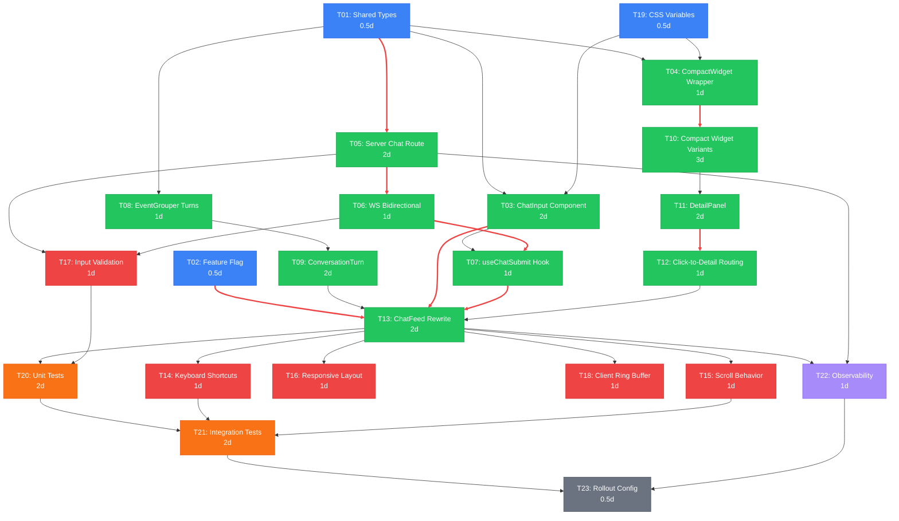

# IMPL-03: Chat UI Copilot Experience

**Source:** [FDR-01: Chat UI Redesign — Copilot Chat VS Code Experience](../fdr/FDR-01-chat-ui-copilot-experience.md)  
**Status:** Planned  
**Date:** 2026-04-09  
**Method:** Pragmatic (hybrid: tests first for critical paths, incremental delivery)

---

## Summary

Transform the read-only event feed into an interactive, conversation-style chat UI inspired by VS Code Copilot Chat. This plan decomposes the FDR-01 implementation steps (Steps 1-14) into 23 atomic tasks organized into 6 tracks with explicit dependencies, parallel execution opportunities, and critical path analysis.

---

## DAG Visualization



<details>
<summary>Mermaid source</summary>



</details>

**Legend:**
- Blue = Foundation | Green = Core | Red = Hardening | Orange = Testing | Purple = Observability | Gray = Rollout
- Bold red edges = Critical path

---

## Critical Path

The longest chain of dependent tasks that determines the minimum project duration:

```
T01 (0.5d) -> T05 (2d) -> T06 (1d) -> T07 (1d) -> T13 (2d) -> T20 (2d) -> T21 (2d) -> T23 (0.5d)
```

**Critical path duration: 11 days**

Alternative near-critical path (widget detail track):
```
T01 (0.5d) -> T04 (1d) -> T10 (3d) -> T11 (2d) -> T12 (1d) -> T13 (2d) -> T20 (2d) -> T21 (2d) -> T23 (0.5d)
```
Duration: 14 days (this is actually the longest path)

**True critical path duration: 14 days**  
**Total effort: 30 person-days**

---

## Parallel Tracks

Tasks with no mutual dependencies that can execute simultaneously:

| Time Window | Track A (Server) | Track B (Widget/Detail) | Track C (Feed Layout) |
|-------------|-------------------|-------------------------|----------------------|
| Day 1 | T01, T02, T19 (foundation, all parallel) | -- | -- |
| Day 2-3 | T05 (server chat route) | T04 (compact wrapper), T03 (ChatInput) | T08 (EventGrouper turns) |
| Day 3-4 | T06 (WS bidirectional) | T10 (compact variants, starts day 3) | T09 (ConversationTurn) |
| Day 4-5 | T07 (useChatSubmit), T17 (validation) | T10 (continues) | -- |
| Day 5-7 | -- | T10 (finishes), T11 (DetailPanel) | -- |
| Day 7-8 | -- | T12 (click routing) | -- |
| Day 8-10 | -- | T13 (ChatFeed rewrite, all deps met) | -- |
| Day 10-11 | -- | T14, T15, T16, T18 (all parallel hardening) | -- |
| Day 11-13 | -- | T20 (unit tests) | T22 (observability) |
| Day 13-14 | -- | T21 (integration tests) | -- |
| Day 14-15 | -- | T23 (rollout config) | -- |

---

## Task Definitions

### T01: Shared Types and ChatMessage Interface
| Field | Value |
|-------|-------|
| **ID** | T01 |
| **Track** | Foundation |
| **Description** | Add `"chat_input"` to `EventType` union. Add `turnId?: string` field to `SessionEvent` interface. Add `ChatMessage` interface: `{ message: string; turnId: string; ts: string }`. Verify `createEventBrowser` helper covers new fields. Remove duplicate `SessionEvent` type from `useEventStream.ts` and import from `shared/types.ts` instead. |
| **Files** | `shared/types.ts` (MODIFY), `src/hooks/useEventStream.ts` (MODIFY -- remove duplicate type, import from shared) |
| **Depends on** | None (root task) |
| **Effort** | 0.5d |
| **Done when** | `ChatMessage` interface exists, `turnId` field on `SessionEvent`, `chat_input` in `EventType` union, no duplicate type definitions, TypeScript compiles clean |

### T02: Feature Flag Setup
| Field | Value |
|-------|-------|
| **ID** | T02 |
| **Track** | Foundation |
| **Description** | Add `CHAT_INPUT_ENABLED` environment variable support. When false, `ChatFeed` renders in classic mode unchanged. Read from `import.meta.env.VITE_CHAT_INPUT_ENABLED` on client. Add to Vite config. |
| **Files** | `src/feed/ChatFeed.tsx` (MODIFY -- add conditional rendering), `vite.config.ts` (MODIFY -- expose env var) |
| **Depends on** | None (root task) |
| **Effort** | 0.5d |
| **Done when** | Setting `VITE_CHAT_INPUT_ENABLED=false` renders the current ChatFeed unchanged; setting to `true` enables new layout path |

### T19: CSS Variables and Design Tokens
| Field | Value |
|-------|-------|
| **ID** | T19 |
| **Track** | Foundation |
| **Description** | Add CSS custom properties for the new UI: `--compact-widget-height` (~78px), `--detail-panel-width` (400px), `--chat-input-height` (auto, min 48px), `--chat-input-bg`, `--border-active`, gradient fade variables for compact truncation. |
| **Files** | `src/index.css` (MODIFY) |
| **Depends on** | None (root task) |
| **Effort** | 0.5d |
| **Done when** | CSS variables defined in `:root` and `[data-theme="dark"]`/`[data-theme="light"]` selectors; existing styles unbroken |

### T03: ChatInput Component
| Field | Value |
|-------|-------|
| **ID** | T03 |
| **Track** | Core |
| **Description** | Create `ChatInput.tsx`: textarea with `var(--bg-input)` background. Enter to submit, Shift+Enter for newline. Submit button with `Send` icon from lucide-react. Disabled state when `connected === false`. Character count indicator (max 10,000 chars). Debounced submit (300ms) to prevent rapid double-send. Props: `onSubmit(message: string)`, `connected: boolean`, `disabled: boolean`. |
| **Files** | `src/feed/ChatInput.tsx` (NEW) |
| **Depends on** | T01, T19 |
| **Effort** | 2d |
| **Done when** | Component renders textarea + send button; Enter submits non-empty text; Shift+Enter inserts newline; disabled when disconnected; character limit enforced; debounce prevents rapid submit |

### T04: CompactWidget Wrapper Component
| Field | Value |
|-------|-------|
| **ID** | T04 |
| **Track** | Core |
| **Description** | Create `CompactWidget.tsx`: wrapper enforcing `max-height: var(--compact-widget-height)` with `overflow: hidden` and bottom gradient fade. Accepts `onClick` prop for detail-panel opening. Wraps children with cursor pointer styling. |
| **Files** | `src/feed/CompactWidget.tsx` (NEW) |
| **Depends on** | T01, T19 |
| **Effort** | 1d |
| **Done when** | Wrapper constrains child height to ~4 lines; gradient fade visible at bottom when content truncated; onClick fires with event data; cursor shows pointer |

### T05: Server Chat Endpoint
| Field | Value |
|-------|-------|
| **ID** | T05 |
| **Track** | Core |
| **Description** | Create `POST /api/chat` route accepting `{ message: string, turnId: string }`. Validate input with schema (message non-empty, under 10KB, turnId is string). Create `user_prompt` event via EventBus. Forward message to AI backend (configurable URL via `AI_BACKEND_URL` env var). Stream response events back through EventBus. Add 30s timeout with AbortController. Add `"chat_input"` to `VALID_TYPES` in events.ts. Register route in server/index.ts. |
| **Files** | `server/routes/chat.ts` (NEW), `server/index.ts` (MODIFY), `server/routes/events.ts` (MODIFY) |
| **Depends on** | T01 |
| **Effort** | 2d |
| **Done when** | `POST /api/chat` accepts message, emits `user_prompt` event on EventBus, forwards to configurable backend URL, handles timeout and errors gracefully, returns error event on failure |

### T06: WebSocket Bidirectional Messaging
| Field | Value |
|-------|-------|
| **ID** | T06 |
| **Track** | Core |
| **Description** | Server: add `socket.on("message", handler)` to WebSocket registration at `server/index.ts` lines 80-84. Parse incoming messages, validate structure (only accept `chat_input` type). Forward valid messages to chat route handler. Client: expose `send(msg: ChatMessage)` from `useEventStream` hook using `wsRef.current.send()`. |
| **Files** | `server/index.ts` (MODIFY -- lines 80-84), `src/hooks/useEventStream.ts` (MODIFY -- add send method) |
| **Depends on** | T05 |
| **Effort** | 1d |
| **Done when** | Client can call `send()` on the hook to send `chat_input` messages; server receives, validates, and processes them; invalid messages are rejected silently; `useEventStream` returns `{ events, connected, clear, send }` |

### T07: useChatSubmit Hook
| Field | Value |
|-------|-------|
| **ID** | T07 |
| **Track** | Core |
| **Description** | Create `useChatSubmit.ts` hook encapsulating: send via WebSocket, optimistic event insertion (immediately add `user_prompt` to local events), message queue during disconnection, retry on reconnect with dedup ID, error handling with inline error state. |
| **Files** | `src/hooks/useChatSubmit.ts` (NEW) |
| **Depends on** | T03, T06 |
| **Effort** | 1d |
| **Done when** | Hook sends message via WS; optimistically inserts event; queues messages when disconnected; retries on reconnect; deduplicates by message ID; exposes `{ submit, pending, error }` |

### T08: EventGrouper Turn-Based Grouping
| Field | Value |
|-------|-------|
| **ID** | T08 |
| **Track** | Core |
| **Description** | Add `groupByTurn()` function to `EventGrouper.ts`. Groups events between consecutive `user_prompt` events into "turns". Uses `turnId` when available on events, falls back to position-based grouping for backward compatibility (events from old hooks without `turnId`). Orphaned events without a parent turn go into an "ungrouped" section. Add `ConversationTurn` type to the grouper. |
| **Files** | `src/feed/EventGrouper.ts` (MODIFY) |
| **Depends on** | T01 |
| **Effort** | 1d |
| **Done when** | `groupByTurn()` correctly groups events by `turnId`; falls back to position-based grouping; orphaned events handled; existing `groupEvents()` still works for classic mode |

### T09: ConversationTurn Component
| Field | Value |
|-------|-------|
| **ID** | T09 |
| **Track** | Core |
| **Description** | Create `ConversationTurn.tsx`: renders a user prompt header followed by nested compact widgets for tool events in that turn. Shows "Waiting for response..." indicator when turn has zero tool events. Visual thread block styling with left border accent. |
| **Files** | `src/feed/ConversationTurn.tsx` (NEW) |
| **Depends on** | T08 |
| **Effort** | 2d |
| **Done when** | Component renders user prompt + child tool events grouped visually; empty turns show waiting indicator; left-border thread styling applied |

### T10: Compact Widget Variants for All 14 Widget Types
| Field | Value |
|-------|-------|
| **ID** | T10 |
| **Track** | Core |
| **Description** | Add `compact?: boolean` and `onClick?: () => void` props to all 14 widget files. In compact mode: `UserPrompt` shows 2 lines; `BashCommand` shows `$ command` only (no output); `CodeDiff` shows `file.ts (+3/-2)` one-liner; `FileCreate` shows `+ file.ts (NEW)`; `FileRead` shows path one-liner; `SearchResult` shows `pattern (N matches)`; `AgentStart` shows `Agent: desc` with spinner; `AgentResult` shows checkmark one-liner; `JobStatus` shows badge; `QuestionWidget` shows truncated question; `GenericEvent`/`SessionEvent`/`ReadGroup`/`SearchGroup` add onClick. Update `EventRouter.tsx` to forward `compact` and `onClick` props. |
| **Files** | `src/feed/widgets/UserPrompt.tsx`, `src/feed/widgets/BashCommand.tsx`, `src/feed/widgets/CodeDiff.tsx`, `src/feed/widgets/FileCreate.tsx`, `src/feed/widgets/FileRead.tsx`, `src/feed/widgets/SearchResult.tsx`, `src/feed/widgets/AgentStart.tsx`, `src/feed/widgets/AgentResult.tsx`, `src/feed/widgets/JobStatus.tsx`, `src/feed/widgets/QuestionWidget.tsx`, `src/feed/widgets/GenericEvent.tsx`, `src/feed/widgets/SessionEvent.tsx`, `src/feed/widgets/ReadGroup.tsx`, `src/feed/widgets/SearchGroup.tsx`, `src/feed/EventRouter.tsx` (all MODIFY) |
| **Depends on** | T04 |
| **Effort** | 3d |
| **Done when** | All 14 widgets render compact variant (max 4 lines); all support `onClick` callback; `EventRouter` passes `compact` and `onClick` props; non-compact mode unchanged |

### T11: DetailPanel Sidebar Component
| Field | Value |
|-------|-------|
| **ID** | T11 |
| **Track** | Core |
| **Description** | Create `DetailPanel.tsx`: sliding sidebar panel (right side, 400px default width). Receives `selectedEvent: SessionEvent or null`. Renders full (non-compact) widget via `EventRouter`. Close button + Escape key handler. Smooth CSS transform slide-in animation. Subscribes to event updates by ID for live content refresh. |
| **Files** | `src/feed/DetailPanel.tsx` (NEW), `src/App.tsx` (MODIFY -- add selectedEvent state, render DetailPanel) |
| **Depends on** | T10 |
| **Effort** | 2d |
| **Done when** | Panel slides in from right when event selected; renders full widget content; closes on Escape or button click; updates live when event data changes |

### T12: Widget-to-Detail Click Routing
| Field | Value |
|-------|-------|
| **ID** | T12 |
| **Track** | Core |
| **Description** | Wire compact widget clicks through to App-level state. Each compact widget click calls `onSelectEvent(event)` which propagates up from `ConversationTurn` -> `ChatFeed` -> `App.tsx`. App sets `selectedEvent` state, triggering `DetailPanel` render. Highlight selected widget in feed with `var(--border-active)` border. |
| **Files** | `src/feed/ChatFeed.tsx` (MODIFY), `src/feed/ConversationTurn.tsx` (MODIFY), `src/App.tsx` (MODIFY) |
| **Depends on** | T11 |
| **Effort** | 1d |
| **Done when** | Clicking compact widget opens DetailPanel with full content; selected widget shows active border; clicking another widget switches detail; clicking outside closes panel |

### T13: ChatFeed Major Rewrite
| Field | Value |
|-------|-------|
| **ID** | T13 |
| **Track** | Core |
| **Description** | Restructure ChatFeed to render `ConversationTurn` blocks instead of flat grouped events. Integrate `ChatInput` at bottom (pinned with `flexShrink: 0`). Separate scroll container for feed area above ChatInput. Move filter controls (show reads toggle, event count) to header area. Feature flag gate: when `CHAT_INPUT_ENABLED` is false, render classic flat layout. Pass `onSelectEvent` callback through to conversation turns. |
| **Files** | `src/feed/ChatFeed.tsx` (MAJOR REWRITE) |
| **Depends on** | T02, T03, T07, T09, T12 |
| **Effort** | 2d |
| **Done when** | Feed renders threaded conversation turns with compact widgets; ChatInput pinned at bottom; scroll container independent of input; feature flag toggles between classic and new layout; onSelectEvent wired through |

### T14: Keyboard Shortcuts and Focus Management
| Field | Value |
|-------|-------|
| **ID** | T14 |
| **Track** | Hardening |
| **Description** | Add Ctrl+L/Cmd+L to focus ChatInput (VS Code convention). Escape closes DetailPanel first, then unfocuses ChatInput. Up/Down arrows in ChatInput navigate message history. Tab in feed navigates between compact widgets. Audit existing shortcuts in `App.tsx` lines 79-95 for conflicts. Use `event.stopPropagation()` in ChatInput to prevent bubbling. |
| **Files** | `src/App.tsx` (MODIFY), `src/feed/ChatInput.tsx` (MODIFY) |
| **Depends on** | T13 |
| **Effort** | 1d |
| **Done when** | All keyboard shortcuts work; no conflicts with existing Ctrl+B and Ctrl+1/2 shortcuts; focus management correct |

### T15: Scroll Behavior Recalibration
| Field | Value |
|-------|-------|
| **ID** | T15 |
| **Track** | Hardening |
| **Description** | Separate scroll container: feed area above ChatInput scrolls independently. Preserve auto-scroll when at bottom. Pin scroll to bottom when new turn starts. Preserve scroll position when user is reading older turns. Recalibrate 50px threshold from `ChatFeed.tsx` line 35 for new layout geometry. Handle scroll position preservation across layout changes. |
| **Files** | `src/feed/ChatFeed.tsx` (MODIFY) |
| **Depends on** | T13 |
| **Effort** | 1d |
| **Done when** | Auto-scroll works at bottom; user scroll position preserved when reading history; new turns trigger scroll-to-bottom when already at bottom; no scroll jumps on layout changes |

### T16: Responsive Layout Adjustments
| Field | Value |
|-------|-------|
| **ID** | T16 |
| **Track** | Hardening |
| **Description** | DetailPanel respects minimum width (300px) and collapses on narrow screens. ChatInput stacks vertically on very narrow panels. Media queries or container queries for panel width breakpoints. Ensure existing 3-column layout (sidebar + editor + right panel) still works with new components. |
| **Files** | `src/App.tsx` (MODIFY), `src/index.css` (MODIFY) |
| **Depends on** | T13 |
| **Effort** | 1d |
| **Done when** | Detail panel collapses gracefully on narrow screens; ChatInput adapts to narrow widths; no layout overflow or scrollbar issues at various widths |

### T17: Input Validation and Sanitization
| Field | Value |
|-------|-------|
| **ID** | T17 |
| **Track** | Hardening |
| **Description** | Client-side: validate empty messages, enforce 10,000 char limit, disable submit during send. Server-side: validate WebSocket message structure in `socket.on("message")` handler (only accept `chat_input` type), validate `POST /api/chat` payload size (Fastify `bodyLimit`), sanitize message content for defense-in-depth (no HTML tags in message field). |
| **Files** | `server/index.ts` (MODIFY), `server/routes/chat.ts` (MODIFY), `src/feed/ChatInput.tsx` (MODIFY) |
| **Depends on** | T05, T06 |
| **Effort** | 1d |
| **Done when** | Empty messages rejected client and server side; oversized messages rejected; WebSocket only accepts valid `chat_input` structure; no XSS vectors; Fastify bodyLimit set |

### T18: Client-Side Ring Buffer
| Field | Value |
|-------|-------|
| **ID** | T18 |
| **Track** | Hardening |
| **Description** | Address unbounded client event array (current `useEventStream.ts` line 55). Add client-side ring buffer keeping last 1000 events. Older conversation turns collapse to summary lines. Warn via console at 80% capacity. Preserve event deduplication across reconnect history replays (use event `id` field). |
| **Files** | `src/hooks/useEventStream.ts` (MODIFY) |
| **Depends on** | T13 |
| **Effort** | 1d |
| **Done when** | Client events capped at 1000; old events evicted FIFO; reconnect history merged without duplicates; no memory growth over long sessions |

### T20: Unit Tests
| Field | Value |
|-------|-------|
| **ID** | T20 |
| **Track** | Testing |
| **Description** | Add Vitest + React Testing Library to devDependencies. Write unit tests for: `ChatInput.test.tsx` (submit on Enter, no submit on empty, Shift+Enter newline, disabled when disconnected), `CompactWidget.test.tsx` (enforces max height, fires onClick, renders children), `ConversationTurn.test.tsx` (groups events correctly, handles empty turns), `DetailPanel.test.tsx` (renders full widget, closes on Escape, closes on button), `EventGrouper.test.ts` (turn grouping with turnId, fallback grouping, mixed events, orphaned events), `useChatSubmit.test.ts` (sends via WS, queues during disconnect, deduplicates). |
| **Files** | `package.json` (MODIFY -- add vitest, @testing-library/react), `vitest.config.ts` (NEW), `src/feed/__tests__/ChatInput.test.tsx` (NEW), `src/feed/__tests__/CompactWidget.test.tsx` (NEW), `src/feed/__tests__/ConversationTurn.test.tsx` (NEW), `src/feed/__tests__/DetailPanel.test.tsx` (NEW), `src/feed/__tests__/EventGrouper.test.ts` (NEW), `src/hooks/__tests__/useChatSubmit.test.ts` (NEW) |
| **Depends on** | T13, T17 |
| **Effort** | 2d |
| **Done when** | All unit tests pass; coverage for new components > 80%; test runner configured in package.json scripts |

### T21: Integration and E2E Tests
| Field | Value |
|-------|-------|
| **ID** | T21 |
| **Track** | Testing |
| **Description** | Full conversation flow test: type message -> see in feed -> click widget -> see detail panel. Reconnection test: disconnect WebSocket -> queue message -> reconnect -> message delivered. Backward compatibility: POST `/api/events` without `turnId` -> renders in flat fallback. Performance: render 500 events without frame drops (React Profiler). WebSocket message flow with mock server. |
| **Files** | `src/__tests__/integration/chat-flow.test.tsx` (NEW), `src/__tests__/integration/reconnection.test.tsx` (NEW), `src/__tests__/integration/backward-compat.test.tsx` (NEW), `src/__tests__/integration/performance.test.tsx` (NEW) |
| **Depends on** | T20, T14, T15 |
| **Effort** | 2d |
| **Done when** | All integration tests pass; full chat flow verified end-to-end; reconnection resilience verified; backward compatibility confirmed; 500-event render completes without jank |

### T22: Observability Metrics and Logging
| Field | Value |
|-------|-------|
| **ID** | T22 |
| **Track** | Observability |
| **Description** | Add metrics: `chat.input.submitted` (counter), `chat.input.latency_ms` (time from submit to first response event), `chat.detail_panel.opened` (counter), `ws.client_messages.received` (counter), `chat.api.duration_ms` (histogram of `/api/chat` response time). Add log entries: server-side `[chat] message received turnId={turnId} length={length}`, `[chat] backend error: {error}`. Client: console.warn on WebSocket send failure. |
| **Files** | `server/routes/chat.ts` (MODIFY), `server/index.ts` (MODIFY), `src/hooks/useChatSubmit.ts` (MODIFY), `src/feed/DetailPanel.tsx` (MODIFY) |
| **Depends on** | T13, T05 |
| **Effort** | 1d |
| **Done when** | All 5 metrics emitted; log entries appear for chat messages and errors; client warns on send failure |

### T23: Rollout Configuration
| Field | Value |
|-------|-------|
| **ID** | T23 |
| **Track** | Rollout |
| **Description** | Configure staged rollout: document `CHAT_INPUT_ENABLED` flag usage, add localStorage-based percentage rollout (20% -> 100%), define canary metrics thresholds (JS error rate > 5%, WS failure > 10%, `/api/chat` 5xx > 2%), document rollback procedure. |
| **Files** | `README.md` (MODIFY -- add rollout section), `src/feed/ChatFeed.tsx` (MODIFY -- add localStorage rollout percentage check) |
| **Depends on** | T21, T22 |
| **Effort** | 0.5d |
| **Done when** | Rollout documented; percentage-based rollout mechanism works; rollback is single env var change |

---

## Effort Summary

| Track | Tasks | Total Effort |
|-------|-------|-------------|
| Foundation | T01, T02, T19 | 1.5d |
| Core | T03, T04, T05, T06, T07, T08, T09, T10, T11, T12, T13 | 18d |
| Hardening | T14, T15, T16, T17, T18 | 5d |
| Testing | T20, T21 | 4d |
| Observability | T22 | 1d |
| Rollout | T23 | 0.5d |
| **Total** | **23 tasks** | **30 person-days** |

**Critical path duration:** 14 working days (with parallel execution)  
**Calendar estimate:** ~3 weeks (accounting for parallel tracks)

---

## Phases (Pragmatic Method)

### Pre-flight (Day 1)
T01, T02, T19 -- all root tasks, execute in parallel.

### Foundation (Days 2-4)
T03, T04, T05, T08 -- ChatInput, CompactWidget, server route, and EventGrouper. All depend only on T01/T19 and can run in parallel across two developers.

### Core (Days 4-10)
T06, T07, T09, T10, T11, T12 -- WebSocket bidirectional, submit hook, conversation turns, compact variants, detail panel, click routing. Some parallelism between server track (T06->T07) and widget track (T10->T11->T12).

### Integration (Days 10-11)
T13 -- ChatFeed rewrite. All dependencies must be complete. This is the integration point where all components come together.

### Hardening (Days 11-12)
T14, T15, T16, T17, T18 -- all depend on T13, all can run in parallel.

### Testing + Observability (Days 12-14)
T20, T21, T22 -- unit tests, integration tests, and observability. T20 and T22 can run in parallel; T21 follows T20.

### Rollout (Day 14-15)
T23 -- final rollout configuration after all tests and observability in place.

---

## Risk Mitigations Built Into Tasks

| FDR Risk | Mitigating Task(s) |
|----------|-------------------|
| WebSocket message loss on reconnect | T07 (message queue + retry), T18 (dedup on reconnect) |
| XSS via chat input | T17 (input validation + sanitization) |
| Race condition: rapid submit | T03 (debounce), T17 (server validation) |
| Scroll position resets | T15 (dedicated scroll behavior task) |
| Detail panel content overflow | T11 (max-height + overflow scroll) |
| AI backend timeout | T05 (30s timeout + AbortController) |
| Unbounded client events | T18 (client ring buffer) |
| Backward compatibility | T08 (fallback position-based grouping), T02 (feature flag) |
| Keyboard shortcut conflicts | T14 (audit + stopPropagation) |

---

## Backward Compatibility

- Feature flag (T02) ensures zero-risk rollout -- classic mode preserved
- EventGrouper (T08) falls back to position-based grouping when `turnId` absent
- `POST /api/events` endpoint unchanged -- old hooks continue working
- All widget non-compact mode unchanged -- `compact` prop defaults to `false`
