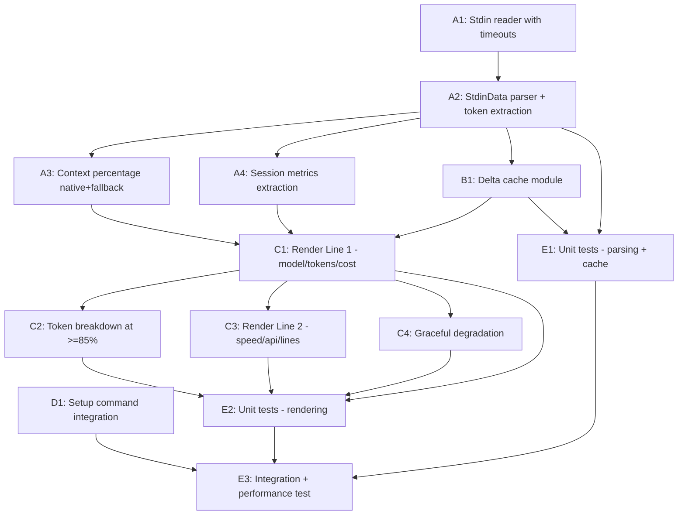

# IMPL-04: Native StatusLine Stdin Telemetry

**Date:** 2026-04-13 **Method:** Pragmatic **Tracks:** 5 **Total tasks:** 14 **Critical path:** A1 → A2 → B1 → C1 → C3 → E3

**Source:** [ADR-01-native-statusline-stdin-telemetry](../adr/ADR-01-native-statusline-stdin-telemetry.md)

---

## Overview

Replace the existing bash statusline script with a Node.js handler (`statusline-handler.mjs`) that reads the full Claude Code stdin JSON contract, extracts all 4 token buckets plus session metrics, computes per-request deltas via a temp-file cache, and renders multi-line ANSI output.

**Explicitly out of scope:** `plugins/ai/hooks/hooks.json` — hooks do not receive token/cost data; no changes needed.

---

## DAG

**Critical path:** A1 → A2 → B1 → C1 → C3 → E3

**Parallel opportunities:**
- Track D (setup integration) runs fully parallel with Tracks A/B/C
- A3 and A4 can run in parallel after A2
- C2, C3, C4 can run in parallel after C1

---

## Tasks

### Track A: Stdin Parsing (Foundational)

#### A1: Stdin Reader with Timeout Guards

| Field | Value |
|-------|-------|
| **ID** | A1 |
| **Title** | Stdin reader with timeout guards |
| **Description** | Create the stdin reader function in `statusline-handler.mjs` that reads JSON from stdin with safety limits: 250ms first-byte timeout (return null if no data), 30ms idle timeout after data starts flowing, 256KB max bytes cap. Return raw string or null on timeout/empty. |
| **Affected files** | `plugins/ai/scripts/statusline-handler.mjs` (create) |
| **Depends on** | — |
| **Effort** | S (1-2 hrs) |
| **Track** | A |
| **AAC** | AAC-07, AAC-08 |

#### A2: StdinData JSON Parser and Token Extraction

| Field | Value |
|-------|-------|
| **ID** | A2 |
| **Title** | StdinData JSON parser with 4-bucket token extraction |
| **Description** | Parse the raw stdin string as JSON into the `StdinData` shape. Extract `input_tokens`, `output_tokens`, `cache_creation_input_tokens`, `cache_read_input_tokens` from `context_window.current_usage`. All access uses optional chaining. Compute `totalInputTokens` (sum of input + cache_creation + cache_read). Export a `parseStdinData(raw)` function returning a normalized metrics object or null. |
| **Affected files** | `plugins/ai/scripts/statusline-handler.mjs` |
| **Depends on** | A1 |
| **Effort** | S (1-2 hrs) |
| **Track** | A |
| **AAC** | AAC-01 |

#### A3: Context Percentage (Native + Fallback)

| Field | Value |
|-------|-------|
| **ID** | A3 |
| **Title** | Context percentage: native preferred, manual fallback |
| **Description** | Implement `getContextPercent(stdinData)`: prefer `context_window.used_percentage` when it is a finite number (native, v2.1.6+). Fall back to `(totalInputTokens / context_window_size) * 100` when native is absent. Clamp to 0-100, round to integer. |
| **Affected files** | `plugins/ai/scripts/statusline-handler.mjs` |
| **Depends on** | A2 |
| **Effort** | XS (<1 hr) |
| **Track** | A |
| **AAC** | AAC-02 |

#### A4: Session Metrics Extraction

| Field | Value |
|-------|-------|
| **ID** | A4 |
| **Title** | Extract session metrics from cost object |
| **Description** | Extract `cost.total_cost_usd`, `cost.total_duration_ms`, `cost.total_api_duration_ms`, `cost.total_lines_added`, `cost.total_lines_removed` from the parsed stdin data. Compute API duration ratio (`api_ms / total_ms`). All fields optional; return null for absent values. |
| **Affected files** | `plugins/ai/scripts/statusline-handler.mjs` |
| **Depends on** | A2 |
| **Effort** | XS (<1 hr) |
| **Track** | A |
| **AAC** | AAC-06 |

---

### Track B: Delta Cache

#### B1: Delta Cache Module

| Field | Value |
|-------|-------|
| **ID** | B1 |
| **Title** | Delta cache for per-request token speed |
| **Description** | Create `statusline-cache.mjs` that reads/writes `/tmp/.claude-statusline-cache.json`. Implements `computeDeltas(current)`: read previous cumulative values, diff `output_tokens` and `input_tokens`, compute `outputSpeed` (tok/s) when delta time is >0 and <=2000ms. Write current values to cache. Handle missing/corrupt cache file gracefully (treat as first invocation). |
| **Affected files** | `plugins/ai/scripts/lib/statusline-cache.mjs` (create) |
| **Depends on** | A2 |
| **Effort** | S (1-2 hrs) |
| **Track** | B |
| **AAC** | AAC-03 |

---

### Track C: Rendering

#### C1: Render Line 1 — Model Badge, Token Totals, Cost

| Field | Value |
|-------|-------|
| **ID** | C1 |
| **Title** | Render Line 1: model, progress bar, context %, tokens, cost |
| **Description** | Build the primary status line: `[Model] ████░░░░ 45% \| in: 38k out: 7k cache: 12k \| $0.42`. Format token counts with `k` suffix (e.g., 38000 → `38k`). Format cost as `$X.XX` (native) or `~$X.XX` (estimated fallback). Use ANSI color for progress bar (green <70%, yellow 70-84%, red >=85%). |
| **Affected files** | `plugins/ai/scripts/statusline-handler.mjs` |
| **Depends on** | A3, A4, B1 |
| **Effort** | M (2-4 hrs) |
| **Track** | C |
| **AAC** | AAC-04, AAC-06 |

#### C2: Token Breakdown at >=85% Context

| Field | Value |
|-------|-------|
| **ID** | C2 |
| **Title** | Token breakdown display at high context usage |
| **Description** | When `contextPercent >= 85`, replace the compact token summary with a detailed breakdown showing individual bucket values: `(in: 150k, cache-w: 20k, cache-r: 22k)`. Hidden at <85%. |
| **Affected files** | `plugins/ai/scripts/statusline-handler.mjs` |
| **Depends on** | C1 |
| **Effort** | XS (<1 hr) |
| **Track** | C |
| **AAC** | AAC-05 |

#### C3: Render Line 2 — Speed, API Ratio, Lines

| Field | Value |
|-------|-------|
| **ID** | C3 |
| **Title** | Render Line 2: output speed, API duration ratio, lines changed |
| **Description** | Build the secondary status line: `speed: 42.1 tok/s \| api: 65% of wall time \| +120 -30 lines`. Show speed only when `outputSpeed` is non-null. Show API ratio only when both durations are present. Show lines only when either `total_lines_added` or `total_lines_removed` is present. |
| **Affected files** | `plugins/ai/scripts/statusline-handler.mjs` |
| **Depends on** | C1 |
| **Effort** | S (1-2 hrs) |
| **Track** | C |
| **AAC** | AAC-06 |

#### C4: Graceful Degradation

| Field | Value |
|-------|-------|
| **ID** | C4 |
| **Title** | Graceful degradation for empty/absent/malformed stdin |
| **Description** | When stdin is empty, times out, or fails JSON parse: output static `[Initializing...]`. When individual fields are absent: show `--` placeholders (e.g., `ctx: --`). Ensure the handler never crashes or throws to stdout — all errors caught and mapped to safe fallback output. |
| **Affected files** | `plugins/ai/scripts/statusline-handler.mjs` |
| **Depends on** | C1 |
| **Effort** | S (1-2 hrs) |
| **Track** | C |
| **AAC** | AAC-07 |

---

### Track D: Setup Integration (Parallel)

#### D1: Setup Command Writes statusLine Config

| Field | Value |
|-------|-------|
| **ID** | D1 |
| **Title** | Update `/ai:setup` to write statusLine.command |
| **Description** | Update `plugins/ai/commands/setup.md` to add a setup step that writes the `statusLine` configuration to `~/.claude/settings.json`. The command value resolves the absolute path to `statusline-handler.mjs` from `CLAUDE_PLUGIN_ROOT` at install time. If `statusLine` already exists, prompt before overwriting. Also update `plugins/ai/scripts/ai-companion.mjs` if the setup logic lives there. |
| **Affected files** | `plugins/ai/commands/setup.md`, `plugins/ai/scripts/ai-companion.mjs` (if applicable) |
| **Depends on** | — |
| **Effort** | S (1-2 hrs) |
| **Track** | D |
| **AAC** | AAC-09 |

---

### Track E: Testing

#### E1: Unit Tests — Parsing and Cache

| Field | Value |
|-------|-------|
| **ID** | E1 |
| **Title** | Unit tests for stdin parsing, token extraction, and delta cache |
| **Description** | Test `parseStdinData` with: full payload (all fields present), minimal payload (only model), empty object, null/undefined fields. Test `getContextPercent` with native percentage present and absent. Test `computeDeltas` with: two sequential calls showing correct speed calculation, first call (no cache), stale cache (delta time >2000ms returns null speed). |
| **Affected files** | `plugins/ai/scripts/__tests__/statusline-handler.test.mjs` (create) |
| **Depends on** | A2, B1 |
| **Effort** | M (2-4 hrs) |
| **Track** | E |
| **AAC** | AAC-01, AAC-02, AAC-03 |

#### E2: Unit Tests — Rendering

| Field | Value |
|-------|-------|
| **ID** | E2 |
| **Title** | Unit tests for rendering and graceful degradation |
| **Description** | Test Line 1 output contains model name, progress bar, token totals, cost. Test token breakdown appears at 85%, hidden at 84%. Test Line 2 contains speed, API ratio, lines when data present. Test empty stdin produces `[Initializing...]`. Test absent individual fields produce `--` placeholders. |
| **Affected files** | `plugins/ai/scripts/__tests__/statusline-handler.test.mjs` |
| **Depends on** | C1, C2, C3, C4 |
| **Effort** | M (2-4 hrs) |
| **Track** | E |
| **AAC** | AAC-04, AAC-05, AAC-06, AAC-07 |

#### E3: Integration and Performance Test

| Field | Value |
|-------|-------|
| **ID** | E3 |
| **Title** | End-to-end integration test and 200ms performance budget |
| **Description** | Integration: pipe a realistic JSON payload to `statusline-handler.mjs` via subprocess, verify stdout contains expected output. Performance: measure wall-clock time of handler execution with typical payload; assert <200ms. Setup integration: run setup command, verify `~/.claude/settings.json` contains correct `statusLine.command` entry. |
| **Affected files** | `plugins/ai/scripts/__tests__/statusline-handler.test.mjs` |
| **Depends on** | E1, E2, D1 |
| **Effort** | M (2-4 hrs) |
| **Track** | E |
| **AAC** | AAC-08, AAC-09 |

---

## Effort Summary

| Track | Tasks | Total Effort |
|-------|-------|-------------|
| A: Stdin Parsing | 4 | ~4-6 hrs |
| B: Delta Cache | 1 | ~1-2 hrs |
| C: Rendering | 4 | ~4-8 hrs |
| D: Setup Integration | 1 | ~1-2 hrs |
| E: Testing | 3 | ~6-12 hrs |
| **Total** | **14** | **~16-30 hrs** |

## Files Created/Modified

| File | Action |
|------|--------|
| `plugins/ai/scripts/statusline-handler.mjs` | Create |
| `plugins/ai/scripts/lib/statusline-cache.mjs` | Create |
| `plugins/ai/commands/setup.md` | Update |
| `plugins/ai/scripts/ai-companion.mjs` | Update (if setup logic resides here) |
| `plugins/ai/scripts/__tests__/statusline-handler.test.mjs` | Create |
| `plugins/ai/hooks/hooks.json` | No change (hooks lack token data) |

## AAC Traceability

| AAC | Task(s) | Description |
|-----|---------|-------------|
| AAC-01 | A2, E1 | Parse all 4 token buckets from stdin |
| AAC-02 | A3, E1 | Native `used_percentage` preferred, manual fallback |
| AAC-03 | B1, E1 | Per-request output token speed via delta cache |
| AAC-04 | C1, E2 | Session token totals on Line 1 |
| AAC-05 | C2, E2 | Token breakdown at >=85% context |
| AAC-06 | A4, C1, C3, E2 | Cost and duration on Line 2 |
| AAC-07 | A1, C4, E2 | Graceful null/absent handling, `[Initializing...]` |
| AAC-08 | A1, E3 | Complete within 200ms |
| AAC-09 | D1, E3 | Setup writes `statusLine.command` to settings.json |

## Risk Register

| Risk | Likelihood | Impact | Mitigation |
|------|-----------|--------|------------|
| Stdin JSON contract changes without notice | Medium | High | All field access uses optional chaining; graceful degradation for any missing field |
| Node.js cold start exceeds 200ms budget | Low | Medium | Measure on CI; consider `--max-old-space-size` or shebang with `--jitless` if needed |
| Delta cache file corruption (concurrent writes) | Low | Low | Wrap read/write in try-catch; treat corrupt cache as first invocation |
| `CLAUDE_PLUGIN_ROOT` not set during setup | Low | Medium | Validate env var before writing config; show clear error message |
