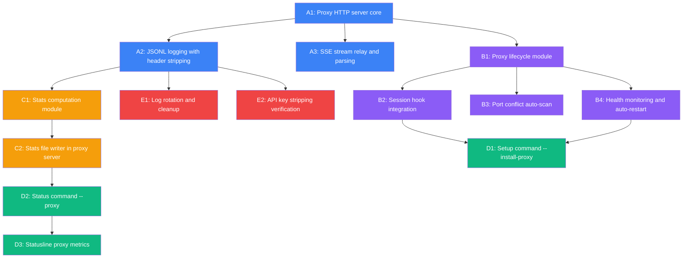

# IMPL-05: Proxy Metrics Integration

**Date:** 2026-04-13 **Method:** Pragmatic **Tracks:** 5 **Total tasks:** 14 **Critical path:** A1 → A2 → C1 → C2 → D2 → D3

**Source:** [FDR-02-proxy-metrics-integration](../fdr/FDR-02-proxy-metrics-integration.md)

---

## Overview

Port the Python reverse proxy (`ccproxycache/reverse-proxy/main.py`) to a Node.js server at `plugins/ai/scripts/proxy-server.mjs` that sits between Claude Code and api.anthropic.com as a zero-overhead passthrough. Integrate proxy lifecycle into session hooks, expose metrics via `/ai:setup --install-proxy` and `/ai:status --proxy`, and enhance the statusline with cache/cost KPIs.

**Key constraint:** The proxy must add <5ms overhead per request. The hot path is `req.pipe(upstreamReq)` + `upstreamRes.pipe(clientRes)` -- kernel-level stream piping with no userspace buffering. All logging, stats, and SSE fan-out are async and off the critical path.

**Note:** No test files exist in the plugin. Verification tasks reference manual checks and FAC criteria rather than unit test files.

**Explicitly out of scope:** `preload.mjs` cache fix (structured as future plugin/patch point only), `plugins/ai/hooks/hooks.json` (session hooks already call `session-lifecycle-hook.mjs`), `plugins/ai/config/defaults.json` (proxy config comes from env vars).

---

## DAG

**Critical path:** A1 → A2 → C1 → C2 → D2 → D3 (10 days)

**Parallel opportunities:**
- A3 (SSE relay) runs in parallel with A2 (both depend only on A1)
- Track B (lifecycle) runs in parallel with Track C (stats) after A1
- B3 (port scan) and B4 (health monitor) run in parallel after B1
- E1 (log rotation) and E2 (key stripping verification) run in parallel after A2
- D1 (setup command) runs in parallel with C1/C2 (depends on B2+B4, not on stats)

---

## Tasks

### Track A: Core Proxy (Foundational)

#### A1: Proxy HTTP Server Core

| Field | Value |
|-------|-------|
| **ID** | A1 |
| **Title** | Proxy HTTP server core |
| **Description** | Create `proxy-server.mjs` as a Node.js port of `ccproxycache/reverse-proxy/main.py`. Implement `node:http.createServer()` bound to `127.0.0.1` (NOT `0.0.0.0`). Handle `GET /health` (returns `{ status, uptime, port }`), `OPTIONS` (CORS preflight), and `POST /v1/*` (passthrough forward). Forward requests to `ANTHROPIC_FORWARD_URL` (default `https://api.anthropic.com`) using zero-overhead stream piping: `req.pipe(upstreamReq)` for request body, `upstreamRes.pipe(clientRes)` for response body. Detect streaming responses via `content-type: text/event-stream` -- for non-streaming, buffer full response and relay with correct `Content-Length`. Handle client disconnect mid-stream (catch `EPIPE`/`ERR_STREAM_WRITE_AFTER_END`). Implement REST API endpoints: `GET /api/logs`, `GET /api/logs/dates`, `GET /api/logs/stream` (SSE fan-out, max 5 concurrent clients). Environment variables: `PROXY_PORT` (default 3001), `ANTHROPIC_FORWARD_URL`, `PROXY_LOG_DIR`. |
| **Affected files** | NEW `plugins/ai/scripts/proxy-server.mjs` |
| **Depends-on** | None |
| **Effort** | 3 days |
| **Track** | A |

#### A2: JSONL Logging with Header Stripping

| Field | Value |
|-------|-------|
| **ID** | A2 |
| **Title** | JSONL logging with security header stripping |
| **Description** | Add daily-rotated JSONL logging to `proxy-server.mjs`. Log files at `.claude/proxy-logs/YYYY-MM-DD.jsonl` with permissions `0o600` (directory `0o700`). Log entry structure: timestamp, method, path, model, is_streaming, request_headers (stripped), request_body (truncated to 100KB with `[truncated]` marker), elapsed_s, response_status, response_headers, response_usage, response_text, response_chunk_count. Strip `x-api-key`, `authorization`, `cookie`, `proxy-authorization` from logged request headers (headers still forwarded to upstream). Use async `fs.appendFile()` called after stream end -- never block the relay path. Handle non-JSON request bodies by storing as `{ "_raw": "<hex preview>" }`. |
| **Affected files** | MODIFY `plugins/ai/scripts/proxy-server.mjs` |
| **Depends-on** | A1 |
| **Effort** | 1 day |
| **Track** | A |

#### A3: SSE Stream Relay and Parsing

| Field | Value |
|-------|-------|
| **ID** | A3 |
| **Title** | SSE stream relay and usage parsing |
| **Description** | Implement SSE-aware streaming relay in `proxy-server.mjs`. For streaming responses: `upstreamRes.pipe(clientRes)` relays chunks at wire speed; a passive `data` listener on the same stream taps chunks for usage extraction -- client sees zero added latency. Parse SSE `data: {...}` lines to extract usage info (input_tokens, output_tokens, cache_creation_input_tokens, cache_read_input_tokens) from `message_start`, `message_delta`, `content_block_delta` events. Handle partial SSE lines spanning chunk boundaries with a line buffer. Wrap each chunk parse in try/catch -- malformed JSON must not crash the relay. For non-streaming responses: buffer full body, relay with correct `Content-Length`. Handle upstream errors (502) and non-SSE responses (429 rate limit) by checking `content-type` header. Use 600s upstream timeout. |
| **Affected files** | MODIFY `plugins/ai/scripts/proxy-server.mjs` |
| **Depends-on** | A1 |
| **Effort** | 2 days |
| **Track** | A |

### Track B: Lifecycle Management

#### B1: Proxy Lifecycle Module

| Field | Value |
|-------|-------|
| **ID** | B1 |
| **Title** | Proxy lifecycle module |
| **Description** | Create `proxy-lifecycle.mjs` following the `broker-lifecycle.mjs` pattern exactly. Exports: `startProxy(cwd, options)` -- spawn `proxy-server.mjs` as detached child process, write pid/port files, poll `/health` every 50ms with max 2s timeout. `stopProxy(cwd)` -- read pid file, kill process tree, cleanup files. `isProxyRunning(cwd)` -- check pid file existence AND HTTP health (both must pass). `saveProxySession(cwd, session)` / `loadProxySession(cwd)` / `clearProxySession(cwd)` -- session state stored at `resolveStateDir(cwd)/proxy.json`. Handle stale pid files: if pid file points to dead process, clear state before restarting. |
| **Affected files** | NEW `plugins/ai/scripts/lib/proxy-lifecycle.mjs` |
| **Depends-on** | A1 |
| **Effort** | 2 days |
| **Track** | B |

#### B2: Session Hook Integration

| Field | Value |
|-------|-------|
| **ID** | B2 |
| **Title** | Session hook integration |
| **Description** | Modify `session-lifecycle-hook.mjs` to integrate proxy lifecycle. In `handleSessionStart()`: if proxy session exists and process is alive, inject `ANTHROPIC_BASE_URL=http://localhost:{port}` via `appendEnvVar()`. Guard: check if `ANTHROPIC_BASE_URL` is already set to a non-localhost URL; skip injection and warn if so. In `handleSessionEnd()`: call `stopProxy(cwd)` to cleanup proxy process. Import `loadProxySession`, `stopProxy`, `isProxyRunning` from `proxy-lifecycle.mjs`. |
| **Affected files** | MODIFY `plugins/ai/scripts/session-lifecycle-hook.mjs` |
| **Depends-on** | B1 |
| **Effort** | 1 day |
| **Track** | B |

#### B3: Port Conflict Auto-scan

| Field | Value |
|-------|-------|
| **ID** | B3 |
| **Title** | Port conflict auto-scan |
| **Description** | Enhance `startProxy()` in `proxy-lifecycle.mjs` to handle port conflicts. Attempt to bind on port 3001; if `EADDRINUSE`, scan ports 3002-3010 for the first available. Use `net.createServer().listen(port)` test to check availability before spawning the proxy process. Report chosen port in session state and setup output. |
| **Affected files** | MODIFY `plugins/ai/scripts/lib/proxy-lifecycle.mjs` |
| **Depends-on** | B1 |
| **Effort** | 1 day |
| **Track** | B |

#### B4: Health Monitoring and Auto-restart

| Field | Value |
|-------|-------|
| **ID** | B4 |
| **Title** | Health monitoring and auto-restart |
| **Description** | Add `ensureProxyHealthy(cwd)` to `proxy-lifecycle.mjs`. Check proxy health via HTTP `/health` endpoint. If down, attempt 1 restart via `stopProxy()` + `startProxy()`. If restart fails, log prominent warning and clear proxy session. Called from `handleSessionStart()` for existing proxy sessions. Document limitation: `CLAUDE_ENV_FILE` is append-only, so if auto-restart fails, `ANTHROPIC_BASE_URL` still points to dead proxy and session is broken until manual restart. |
| **Affected files** | MODIFY `plugins/ai/scripts/lib/proxy-lifecycle.mjs` |
| **Depends-on** | B1 |
| **Effort** | 1 day |
| **Track** | B |

### Track C: Stats and Metrics

#### C1: Stats Computation Module

| Field | Value |
|-------|-------|
| **ID** | C1 |
| **Title** | Stats computation module |
| **Description** | Create `proxy-stats.mjs` with `computeStats(logDir, options)`. Reads JSONL log files and computes: cache hit rate (cache_read_tokens / total_input_tokens), quota burn rate (5h and 7d sliding windows), cache create vs read breakdown, context size per call, per-session cost estimate using hardcoded Anthropic pricing constants (input/output/cache token rates per model). Exports in-memory accumulator class used by proxy-server.mjs for lightweight per-request updates. File output written atomically (write to `.tmp`, rename) to `resolveStateDir(cwd)/proxy-stats.json` matching the schema defined in FDR-02 (proxyPort, upSince, sessionId, totalRequests, totalErrors, cacheHitRate, cacheSummary, quotaBurn, lastRequest, updatedAt). |
| **Affected files** | NEW `plugins/ai/scripts/lib/proxy-stats.mjs` |
| **Depends-on** | A2 |
| **Effort** | 2 days |
| **Track** | C |

#### C2: Stats File Writer in Proxy Server

| Field | Value |
|-------|-------|
| **ID** | C2 |
| **Title** | Stats file writer integration in proxy server |
| **Description** | Integrate the stats accumulator from `proxy-stats.mjs` into `proxy-server.mjs`. After each request is logged, update in-memory stats counters (microsecond-level cost). Sync to `resolveStateDir(cwd)/proxy-stats.json` on a 5-second `setInterval` -- never on every request to avoid I/O pressure. Include all fields from the stats schema: proxyPort, upSince, totalRequests, totalErrors, cacheHitRate, cacheSummary, quotaBurn, lastRequest, updatedAt. |
| **Affected files** | MODIFY `plugins/ai/scripts/proxy-server.mjs` |
| **Depends-on** | C1 |
| **Effort** | 1 day |
| **Track** | C |

### Track D: CLI Integration

#### D1: Setup Command --install-proxy

| Field | Value |
|-------|-------|
| **ID** | D1 |
| **Title** | Setup command --install-proxy |
| **Description** | Add `"install-proxy"` to `booleanOptions` in `handleSetup()` of `ai-companion.mjs`. When `--install-proxy`: check if proxy is already installed (session file exists + process alive); call `startProxy(cwd)` from `proxy-lifecycle.mjs`; report port, pid, log directory, and instructions. If run during active session: inject `ANTHROPIC_BASE_URL` via `appendEnvVar()`. Update `setup.md` argument-hint to include `[--install-proxy]` and add description. |
| **Affected files** | MODIFY `plugins/ai/scripts/ai-companion.mjs`, MODIFY `plugins/ai/commands/setup.md` |
| **Depends-on** | B2, B4 |
| **Effort** | 1 day |
| **Track** | D |

#### D2: Status Command --proxy

| Field | Value |
|-------|-------|
| **ID** | D2 |
| **Title** | Status command --proxy |
| **Description** | Add `"proxy"` to `booleanOptions` in status command handler of `ai-companion.mjs`. When `--proxy`: load proxy session via `loadProxySession(cwd)`, check process alive + HTTP health, read `resolveStateDir(cwd)/proxy-stats.json` for metrics. Render KPI table: cache hit%, cache create/read breakdown, quota burn (5h/7d), cost estimate, request count, uptime, last request model/timing. If proxy not active: report "Proxy not running. Install with /ai:setup --install-proxy". Update `status.md` argument-hint to include `[--proxy]`. |
| **Affected files** | MODIFY `plugins/ai/scripts/ai-companion.mjs`, MODIFY `plugins/ai/commands/status.md` |
| **Depends-on** | C2 |
| **Effort** | 1 day |
| **Track** | D |

#### D3: Statusline Proxy Metrics

| Field | Value |
|-------|-------|
| **ID** | D3 |
| **Title** | Statusline proxy metrics line |
| **Description** | Modify `statusline-handler.mjs` to render an optional third line with proxy metrics when the proxy is active. After rendering existing Line 1 and Line 2, check for `resolveStateDir(cwd)/proxy-stats.json`. If file exists and is recent (< 30s old): render Line 3 with format `[Proxy] cache: 73% | burn: $1.23/5h | reqs: 42 | up: 2h 15m`. Must stay within 200ms total render budget -- use sync file read wrapped in try/catch with graceful fallback (no proxy line if read fails or file stale). |
| **Affected files** | MODIFY `plugins/ai/scripts/statusline-handler.mjs` |
| **Depends-on** | D2 |
| **Effort** | 1 day |
| **Track** | D |

### Track E: Hardening

#### E1: Log Rotation and Cleanup

| Field | Value |
|-------|-------|
| **ID** | E1 |
| **Title** | Log rotation and cleanup |
| **Description** | Add startup log cleanup to `proxy-server.mjs`. On startup: scan `.claude/proxy-logs/` for files older than `PROXY_LOG_MAX_DAYS` (default 30, configurable via env var). Delete old files and log cleanup count. Daily rotation is already handled by the date-based filename pattern in A2. |
| **Affected files** | MODIFY `plugins/ai/scripts/proxy-server.mjs` |
| **Depends-on** | A2 |
| **Effort** | 1 day |
| **Track** | E |

#### E2: API Key Stripping Verification

| Field | Value |
|-------|-------|
| **ID** | E2 |
| **Title** | API key stripping verification |
| **Description** | Add runtime assertion in the JSONL write path of `proxy-server.mjs`: verify no log entry contains `x-api-key` or `authorization` in `request_headers` before writing. Add a startup self-test: create a mock request object with auth headers, run through the stripping logic, assert stripped output. Document the stripped header list (`x-api-key`, `authorization`, `cookie`, `proxy-authorization`) prominently in the file header comment. This is a defense-in-depth measure beyond the stripping in A2. |
| **Affected files** | MODIFY `plugins/ai/scripts/proxy-server.mjs` |
| **Depends-on** | A2 |
| **Effort** | 1 day |
| **Track** | E |

---

## Effort Summary

| Track | Tasks | Total Effort | Can Start After |
|-------|-------|-------------|-----------------|
| A: Core Proxy | A1, A2, A3 | 6 days | Immediately |
| B: Lifecycle | B1, B2, B3, B4 | 5 days | A1 complete |
| C: Stats | C1, C2 | 3 days | A2 complete |
| D: CLI Integration | D1, D2, D3 | 3 days | B2+B4 (D1), C2 (D2), D2 (D3) |
| E: Hardening | E1, E2 | 2 days | A2 complete |
| **Total** | **14** | **19 task-days** | |

**With full parallelism, estimated calendar time:** ~10 days (critical path length: A1[3d] → A2[1d] → C1[2d] → C2[1d] → D2[1d] → D3[1d] + 1d buffer)

---

## Risk Mitigations Embedded in Tasks

| Risk (from FDR-02) | Addressed in Task | Mitigation |
|---------------------|-------------------|------------|
| Proxy crash = API blackout | B4 | Auto-restart with 1 attempt; clear session on failure |
| API key logged in JSONL | A2, E2 | Header stripping + runtime assertion + startup self-test |
| Bind to 0.0.0.0 | A1 | Bind to `127.0.0.1` explicitly |
| Port conflict | B3 | Auto-scan ports 3001-3010 |
| ANTHROPIC_BASE_URL already set | B2 | Guard check for non-localhost URL; skip injection |
| Log disk exhaustion | E1 | Daily rotation + configurable max age cleanup |
| Sync logging blocks hot path | A2, A3 | Async `fs.appendFile()` after stream end; pipe-based relay |
| Body buffering before relay | A1, A3 | `req.pipe(upstreamReq)` + `upstreamRes.pipe(clientRes)` |
| Stats file read race | C1 | Atomic write (tmp + rename); try/catch in reader |
| CLAUDE_ENV_FILE append-only | B4 | Documented limitation; auto-restart is best-effort |

---

## FAC Traceability

| FAC | Verified by Task |
|-----|-----------------|
| FAC-01: Passthrough forwarding | A1 |
| FAC-02: JSONL logging | A2 |
| FAC-03: API key stripping | A2, E2 |
| FAC-04: Setup --install-proxy | D1 |
| FAC-05: ANTHROPIC_BASE_URL injection | B2 |
| FAC-06: Status --proxy KPIs | D2 |
| FAC-07: SessionEnd cleanup | B2 |
| FAC-08: SSE /api/logs/stream | A1 |
| FAC-09: Statusline proxy metrics | D3 |
| FAC-10: Bind 127.0.0.1 only | A1 |
| FAC-11: Port conflict auto-scan | B3 |
| FAC-12: Log file cleanup | E1 |
| FAC-13: No body modification | A1, A3 |
| FAC-14: Cache fix NOT included | A1 (out of scope) |
| FAC-15: <5ms overhead | A1, A3 |
| FAC-16: Stream piping relay | A1, A3 |
| FAC-17: Async logging off hot path | A2 |
| FAC-18: Wire-speed SSE relay | A3 |
