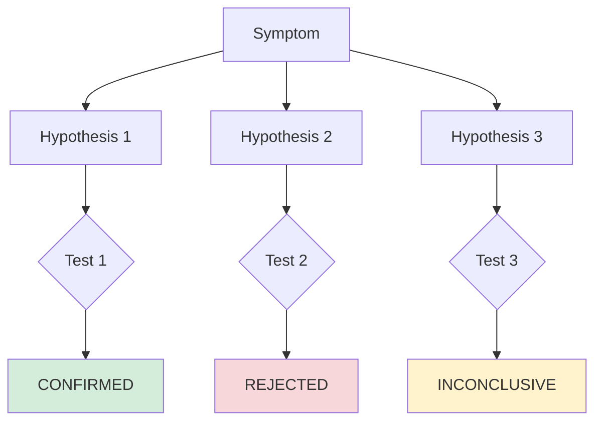
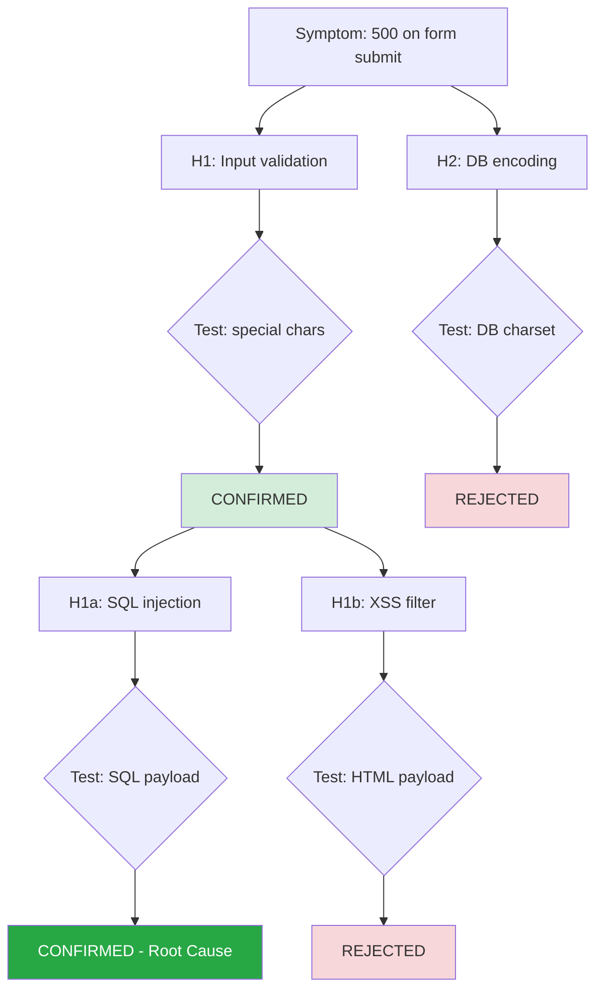

# Hypothesis Debugging Methodology

## Overview

Hypothesis debugging applies the scientific method to software problems. Instead of guessing and patching, you systematically eliminate possibilities until the root cause is isolated.

```
Symptom → Observe → Hypothesize → Test → Conclude → Fix
```

Most debugging fails because developers skip straight from symptom to fix. Hypothesis debugging forces you to gather evidence first, form testable theories, and validate before acting.

## The Four Phases

### Phase 1: OBSERVE

**Goal:** Gather raw evidence about the problem without forming conclusions.

**What to collect:**
- Exact error messages, stack traces, and log output
- Steps to reproduce (or conditions under which it occurs)
- When it started (git log, recent deploys, config changes)
- What works vs what doesn't (narrow the blast radius)
- Related code paths (grep for error messages, function names, variable names)
- Test status (which tests pass, which fail, which are flaky)

**Tools:**
- `grep` / `rg` for error patterns and related code
- `git log --since="1 week ago" --stat` for recent changes
- `git blame <file>` for who last touched suspicious code
- `git bisect` for finding the exact breaking commit
- Test output with verbose logging enabled

**Common mistakes:**
- Assuming you know the cause before looking at evidence
- Only checking the file where the error appears (trace the full data flow)
- Ignoring "unrelated" recent changes (they're often related)

### Phase 2: HYPOTHESIZE

**Goal:** Generate multiple competing explanations ranked by plausibility.

**How to generate hypotheses:**

1. **Work backward from the symptom** — What could produce this exact error?
2. **Follow the data flow** — Where does input enter, transform, and exit?
3. **Check the boundaries** — Where does control pass between components?
4. **Consider recent changes** — What was modified since it last worked?
5. **Think about edge cases** — What inputs or states weren't tested?

**Hypothesis quality checklist:**
- [ ] Specific — names a file, function, or line, not a vague area
- [ ] Testable — has a concrete experiment that confirms or rejects it
- [ ] Falsifiable — the test can produce a definitive "no"
- [ ] Evidence-based — supported by something found in Phase 1
- [ ] Ranked — ordered by likelihood given the evidence

**Hypothesis template:**

```
H1: [Specific description of suspected cause]
- Why plausible: [evidence from Phase 1 that supports this]
- Test: [concrete action to confirm or reject]
- Prediction: [what the test result will be IF this hypothesis is correct]
- Expected if wrong: [what the test result will be IF this is NOT the cause]
```

**Aim for 3-5 hypotheses.** Fewer means you haven't explored enough possibilities. More means you're speculating without evidence.

### Phase 3: TEST

**Goal:** Run each test and collect results. Do not interpret yet.

**Testing principles:**
- **One variable at a time** — each test should confirm/reject exactly one hypothesis
- **Control your environment** — note any differences from production
- **Record everything** — exact commands, full output, timestamps
- **Automated > manual** — write a script, don't rely on manual reproduction
- **Fast tests first** — test the most likely hypothesis with the cheapest experiment

**Test result categories:**
- **CONFIRMED** — test result matches the prediction; hypothesis is likely correct
- **REJECTED** — test result contradicts the prediction; hypothesis is wrong
- **INCONCLUSIVE** — test couldn't produce a clear signal; needs a better experiment

**Script patterns for common test types:**

```bash
# Reproduce a bug with specific input
curl -X POST http://localhost:8000/api/submit \
  -H "Content-Type: application/json" \
  -d '{"name": "O'\''Brien"}' \
  -w "\n%{http_code}\n"

# Check database state
psql -c "SELECT column_name, data_type FROM information_schema.columns WHERE table_name='users';"

# Count queries (Django)
python -c "
from django.test.utils import CaptureQueriesContext
from django.db import connection
with CaptureQueriesContext(connection) as ctx:
    # trigger the code path
    print(f'Queries: {len(ctx)}')
"

# Check for race condition
for i in $(seq 1 100); do
  curl -s http://localhost:8000/api/increment &
done
wait
curl http://localhost:8000/api/counter  # should be 100
```

### Phase 4: CONCLUDE

**Goal:** Synthesize test results into a diagnosis.

**Decision logic:**
- If exactly one hypothesis confirmed → that's your root cause
- If multiple confirmed → they may be related (cause chain) or independent (multiple bugs)
- If none confirmed → go back to Phase 1 with what you learned; expand the search
- If inconclusive → design better tests with stronger signals

**Diagnosis report structure:**

1. **Root cause** — the specific code/config/state that produces the symptom
2. **Evidence** — what test confirmed it, with exact output
3. **Impact** — who/what is affected, how badly
4. **Fix** — concrete change with code (but do NOT apply yet)
5. **Verification** — how to confirm the fix works
6. **Prevention** — what test/check to add so this doesn't recur

## Debug Type Guides

### Bug Debugging

**Common root causes:**
- Missing input validation (special chars, empty strings, nulls, large inputs)
- Uncaught exceptions in async code (missing try/catch, unhandled rejection)
- State corruption (race condition, partial write, stale cache)
- Config mismatch (dev vs prod, missing env var, wrong DB)
- Dependency issue (version mismatch, breaking change, missing package)

**First steps:**
1. Find the exact error message and stack trace
2. Reproduce with minimal input
3. Trace the data from input to error
4. Check what changed recently (`git log`)

### Performance Debugging

**Common root causes:**
- N+1 queries (loop hitting DB per item)
- Missing index (full table scan)
- Synchronous I/O in async handler (blocking event loop)
- Large payload serialization (huge JSON response)
- Missing caching (recomputing expensive results)

**First steps:**
1. Measure baseline (how slow? where in the request lifecycle?)
2. Profile (query log, CPU profiler, memory snapshot)
3. Find the hot path (which code path takes the most time?)
4. Check query count and duration

### Flaky Test Debugging

**Common root causes:**
- Shared mutable state between tests (global vars, DB state)
- Test order dependency (passes alone, fails in suite)
- Timing issues (hardcoded sleep, race between setup and assertion)
- Environment differences (CI has different CPU/memory/network)
- Non-deterministic data (random IDs, auto-increment, timestamps)

**First steps:**
1. Run the test 100 times: `for i in $(seq 100); do npm test -- --testNamePattern="failing test" && echo PASS || echo FAIL; done | sort | uniq -c`
2. Run in isolation vs in full suite
3. Run with `--runInBand` (serial) vs parallel
4. Check for shared state: grep for global variables, module-level state

### Behavior Debugging

**Common root causes:**
- Stale cache (data updated but cache not invalidated)
- Wrong data transformation (serializer/deserializer bug)
- Event ordering (updates processed out of order)
- Client/server state divergence (optimistic update not rolled back)
- Feature flag in wrong state

**First steps:**
1. Compare expected vs actual output precisely
2. Find the divergence point (data correct in DB? in API? in frontend?)
3. Add logging at each transformation step
4. Check cache headers and invalidation logic

## Mermaid Decision Tree Patterns

### Basic hypothesis tree


### Nested hypothesis tree (when first round is inconclusive)


## Anti-Patterns in Debugging

### Shotgun debugging
Changing random things until it works. You don't know what fixed it, can't prevent recurrence, and may introduce new bugs.

### Confirmation bias
Only looking for evidence that supports your first guess. Force yourself to generate at least 3 hypotheses.

### Premature fixing
Applying a fix before confirming the root cause. The fix may mask the real problem or introduce new ones.

### Anchoring on the symptom
The error message tells you WHERE it failed, not WHY. The root cause is often upstream.

### Ignoring the simple explanation
Check the obvious first: typos, wrong config, missing dependency, stale cache. 80% of bugs have simple causes.
