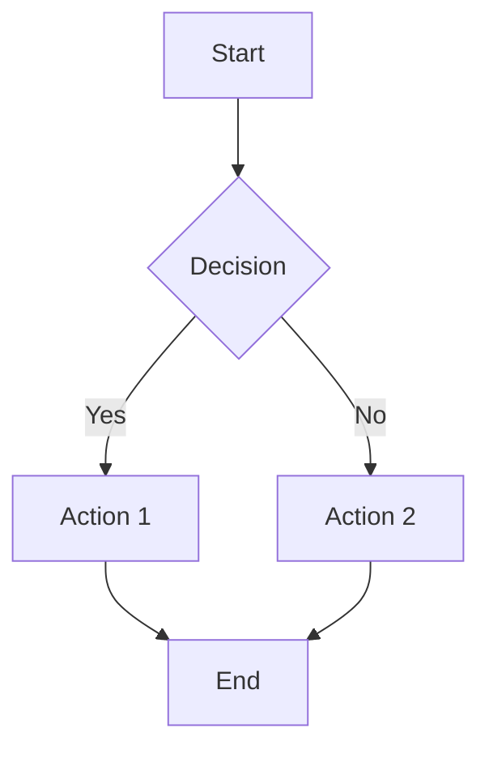
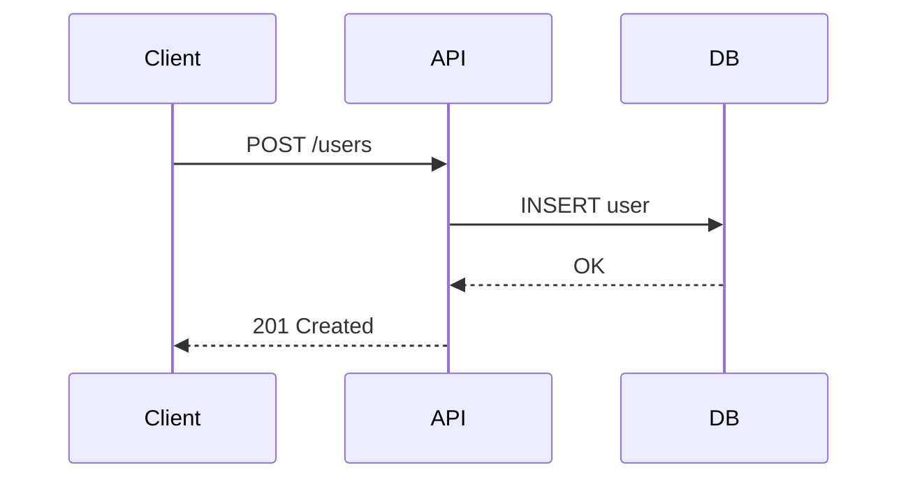
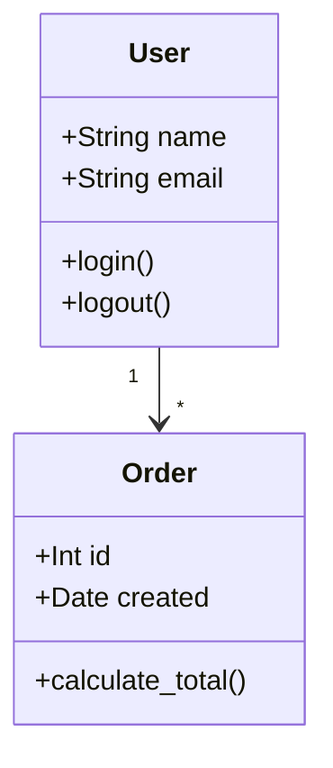
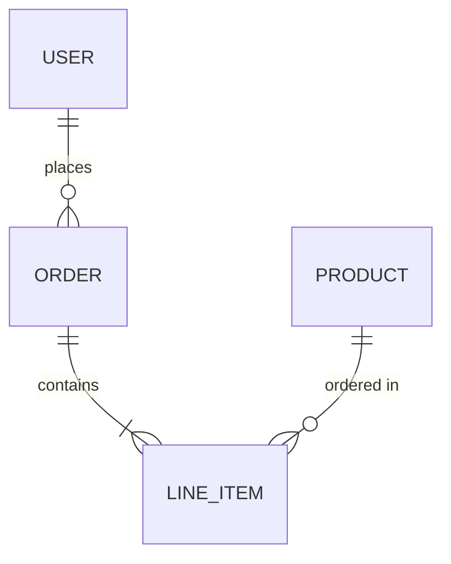
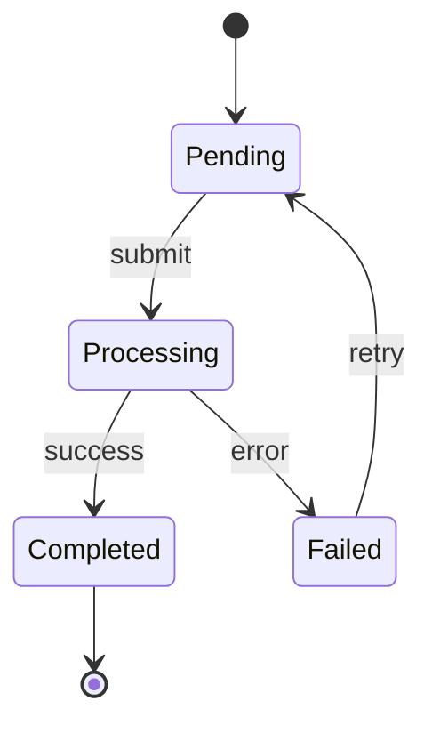
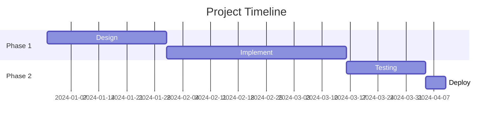

# Mermaid.js Diagrams

Validate Mermaid.js diagram syntax. Image rendering has been removed; use another tool (online playground, IDE plugin) if you need to render a diagram to SVG/PNG.

## Command

```bash
/ai:mermaid validate graph TD; A-->B; B-->C
```

## Setup

If mmdc is not installed:
```bash
/ai:setup --install-mermaid
```

## Quick Syntax Reference

### Flowchart


### Sequence Diagram


### Class Diagram


### ER Diagram


### State Diagram


### Gantt Chart


## Tips

- Use `graph TD` for top-down, `graph LR` for left-right flow
- Wrap node text in `[]` for rectangles, `{}` for diamonds, `()` for rounded, `(())` for circles
- Use `-->` for solid arrows, `-.->` for dotted, `==>` for thick
- Add labels to arrows: `-->|label text|`
- Subgraphs: `subgraph title ... end`
